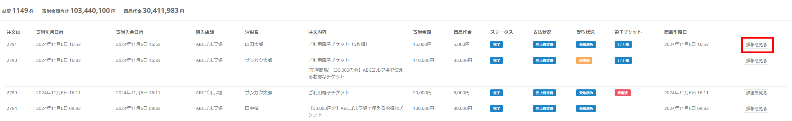
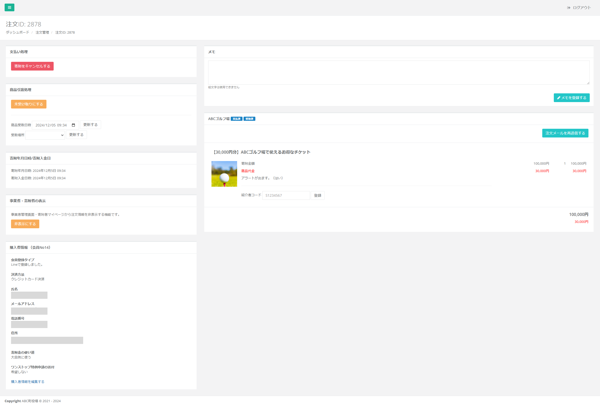
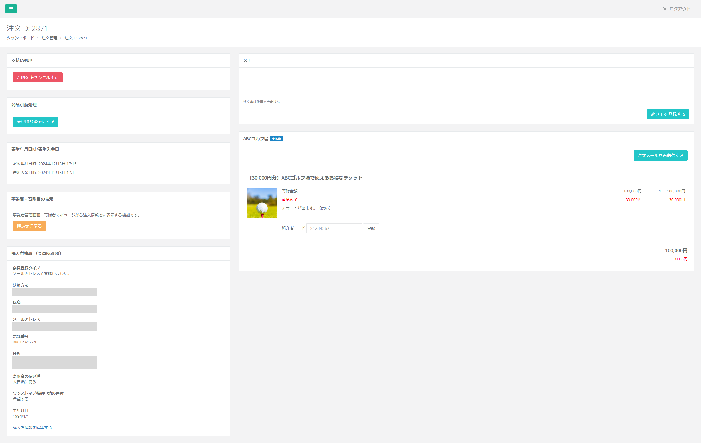
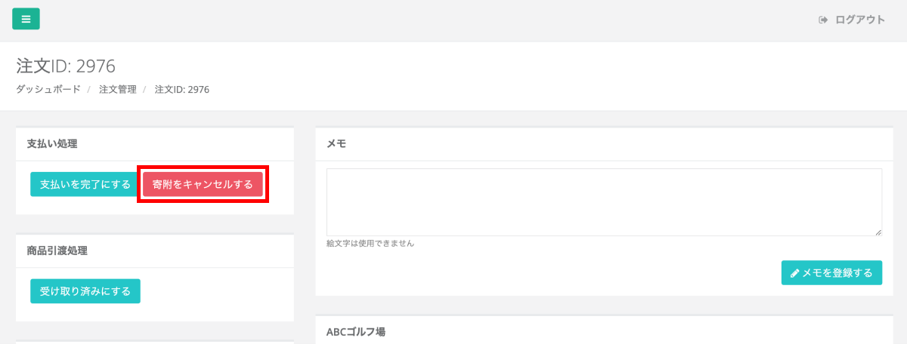
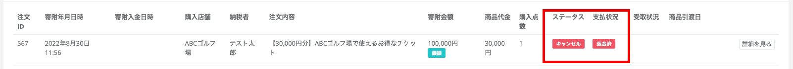
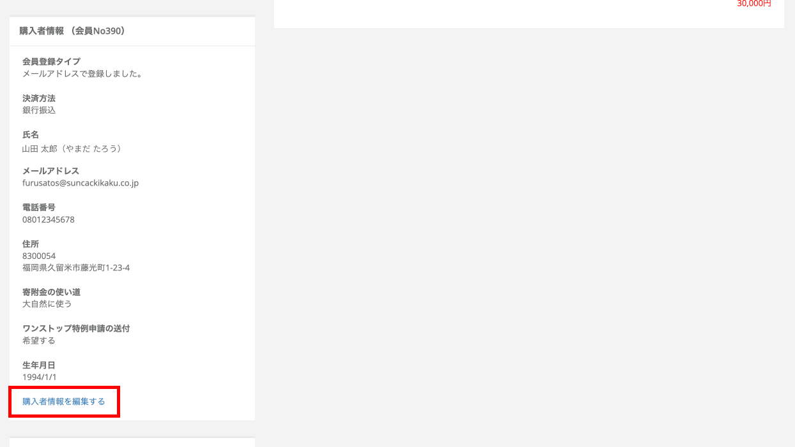
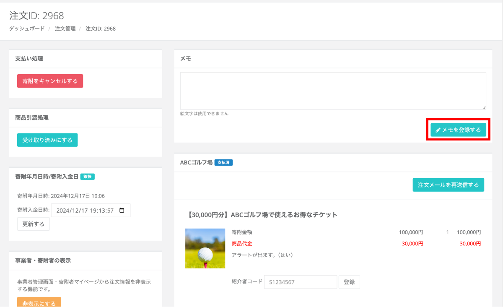

寄附情報の一覧表示、検索、CSV出力、各注文のステータス編集やメモの登録が可能です。

## 寄附情報の検索

*注文管理画面*

注文管理画面の検索フォームでは、下記の項目で注文情報の検索が可能です。
- 注文ID
- メールアドレス
- 名前 or ふりがな
- 電話番号
- 寄附年月日
- 商品引渡日
- 返礼品管理番号
- 店舗名
- 商品引渡（未受け取り・引き渡し済）
- 並び順（昇順・降順指定）
- 受渡方法（現地受渡・完了）
- 支払い方法（クレジットカード・銀行振込）

## CSV出力

*検索フォーム*

検索した結果はCSVでの出力が可能です。  
検索フォーム内にある **「ふるさと納税Do」「レジホーム」「CSVダウンロード」** のいずれかのボタンをクリックするとCSVにて出力されます。  
「ふるさと納税do」「レジホーム」はそれぞれの管理システムへ取り込み可能なフォーマットで出力されます。

:::note[API連携]
ふるさと納税doシステム、レジホーム、Furusato360、エッグへは自動API連携ができます。  
別途セキュリティコードを発行いたしますので、ご連絡ください。
:::

## 注文詳細

 
*注文一覧*

検索フォーム下には、注文一覧が表示されます。  
詳細を確認したい注文の **「詳細を見る」** ボタンをクリックすると、注文詳細画面が確認できます。  

*注文詳細画面（支払済・受け渡し後の場合）*

注文詳細画面では、購入者情報・購入した商品の支払いステータス・商品引き渡しステータス・メモが確認できます。

*注文詳細画面（支払済・受渡前の場合）*

支払い前であれば、画面上に **支払い処理のステータス変更ボタン** と **商品引渡処理のステータス変更ボタン** が表示されますので、実際の状況にあわせて操作してください。

## 支払いステータス

*支払い処理ステータス*

寄附のお支払いがまだの場合は、寄附詳細に支払い処理のステータスが表示されます。  
支払いが完了している場合、寄附入金日時（任意項目）を残した上で  **「支払いを完了にする」**  ボタンをクリックして、ステータスを更新してください。

寄附のキャンセルも必要に応じて実行することが可能です。

## 商品引渡処理（※原則、店舗で処理）

*商品引き渡し処理ステータス*

商品の引き渡し処理は、原則、店舗で認証コードを打ち込むことで処理ができますが、  
以下のような例外時のみ自治体側の管理画面上でステータスを更新することができます。

- 寄附者が店頭で認証コードを表示できない
    - 例）寄附者が自宅から申し込み、来店時にふるさとズにログインができない

**この操作を行う場合には、必ず店舗にて寄附者の本人確認をするようにしてください。**

## 寄附のキャンセル

*注文詳細画面*

寄附者が返礼品交換前にご逝去された等の理由で、  
寄附者からキャンセルのご依頼があった場合は、寄附のキャンセルが可能です。

- 注文詳細画面の支払い処理の項目から、 **「寄附をキャンセルする」** を押下します
- **「本当にキャンセルしますか？」** の画面が出ますので **「OK」** を選択すると、キャンセル完了です

*キャンセル後の注文一覧画面*

キャンセル後は注文一覧画面上のステータスが変更されます。

- ステータス：キャンセル
- 支払状況：返金済

## 購入者情報編集

*注文詳細画面*

購入者情報の変更は、注文詳細画面の **「購入者情報を編集する」** から行います。

*編集画面*

編集画面上で該当項目を修正し、**「登録する」** ボタンをクリックし、変更を確定させます。

## 注文メール再送信

*注文詳細画面*

購入者に注文メールの再送信をお送りしたい場合は、**「注文メール再送信」** ボタンをクリックします。

**「本当に良いですか？」** のポップアップが表示されますので **「OK」** をクリックすると、メールが再送信されます。

## メモ登録

*注文詳細画面*

注文詳細画面から個別のメモを登録することができます。  
※メモの内容の確認および登録は自治体と店舗双方でできます。

*メモ登録後の画面*

メモしておきたい内容を入力し、**「メモを登録する」** ボタンをクリックします。  
登録すると、入力画面下に内容が残ります。  
削除したい場合は右下の **「削除」** をクリックしてください。