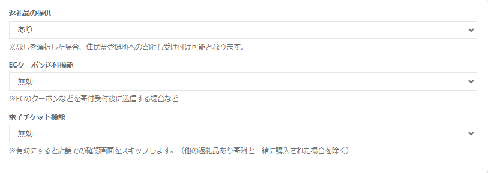
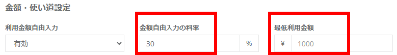
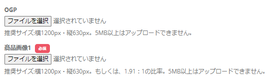
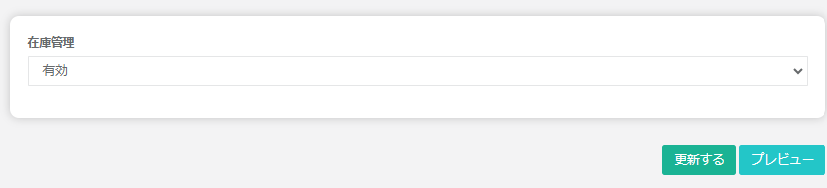
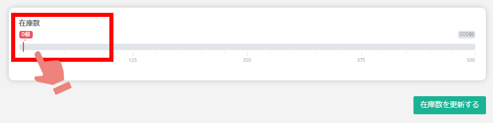

返礼品管理では、ふるさとズに掲載する返礼品の登録が可能です。  

## 返礼品の登録

返礼品の登録をするには、登録画面右上の **「返礼品を登録する」** ボタンをクリックします。

*返礼品管理画面*

返礼品登録画面では、上から順番に必要な情報を入力していきます。  
入力後は **「登録する」** ボタンをクリックします。

以降は、各項目の説明となります。

### 返礼品の提供有無および形式

*返礼品登録項目1*

- **返礼品の提供（あり／なし）**  
返礼品の提供有無を選択します。初期設定は「あり」となっています。 
返礼品なしの寄附ページの登録は、**返礼品の提供「なし」を選択** します。  
「なし」を選択すると、住民票登録地への寄附（お住まいの地域への寄附）も受け付けが可能となります。

- **ECクーポン送付機能（無効／有効）**  
オンラインクーポン返礼品を登録する際は必ず「有効」に設定してください。  
オンラインクーポン返礼品の設定は[オンラインクーポンの設定マニュアル](/lg/online-coupon-activate/)をご覧ください。  

- **電子チケット機能（無効／有効）**  
利用券や回数券を電子チケットとして発行できる機能です。初期設定は「無効」となっています。  
「有効」を選択すると、店舗での確認画面をスキップします。  
※ただし、返礼品ありのものと同時に寄附がされた場合は除く。

### 返礼品基礎設定

*返礼品登録項目2*

- **カテゴリ**  
初期設定で登録されたカテゴリから選択します。  
該当するカテゴリがない場合はシステム管理者（contact@furusatos.com）にお問い合わせください。

- **自治体での管理番号**  
自治体で設定される返礼品の管理番号を入力してください。

- **販売店舗**
返礼品を取り扱う店舗をふるさとズ内に登録済の店舗から選択してください。

### 返礼品詳細設定

*返礼品登録項目3*

- **商品名**  
返礼品の名称を入力してください。

- **商品説明**  
返礼品に関する説明文を入力してください。

- **注意事項**  
ご利用に際して寄附者へ伝えたい注意事項を入力してください。

- **アラートメッセージ**  
購入時にアラートメッセージを出したい場合は、メッセージを設定できます。

### 金額・使い道設定

*返礼品登録項目4*

- **利用金額自由入力（無効／有効）**  
寄附金額を自由に入力することができる機能を設定します。  
初期設定は「無効」となっています。  

:::tip[金額自由入力の料率設定・最低利用金額の設定が可能になりました！]
利用金額自由入力を「有効」にすることで、返礼品毎に料率設定・最低利用金額の設定が可能です。  
:::

*利用金額自由入力*

- **寄附金額**  
実際に寄附する金額を1,000円以上で設定します。

- **商品代金（税込）**  
商品本体の代金を税込で設定します。

- **消費税率**  
商品にかかる税率を設定します。

- **1回の寄附可能数**  
利用者が同時に注文できる数を設定できます。

- **返礼品限定での寄附の使い道**  

:::tip[複数設定が可能になりました！]
ふるさとズでは、返礼品ごとに寄附の使い道の**複数設定**が可能です。  
使い道を企業のCSR活動と連動することで、事業者の想いを伝えることができます。
:::
空白の場合は設定済みの[通常の使い道](/lg/donation)から選択されます。  
※初期設定は空白です。 

*返礼品編集画面の中央部*

### 商品画像設定

*返礼品登録項目5*

- **OGP**  
SNSでシェアされた際に表示されるサムネイル画像を設定できます。

- **商品画像1〜8**  
商品画像を最大8枚まで設定できます。

### 表示設定

*返礼品登録項目6*

- **表示状態（公開中／非表示中）**  
返礼品の表示状態を選択します。初期設定は公開中です。  
受付開始日からの表示開始となります。

- **受付開始日・終了日**  
受付の開始日・終了日を設定します。  
期間限定で受け付ける場合には終了日を設定してください。

- **在庫：**  
在庫を管理する場合は有効を選択します。  
有効を選択して「更新する」を押下すると在庫数設定項目が表示されます。  
表示された赤い目盛り線を左右にスクロールし、ご希望の数をお選びいただき、「在庫数を更新する」を押下します。

*在庫管理項目*

*在庫数設定項目*

:::caution[受け渡し商品の無い寄附の場合のフローについて]

**＜通常の（受け渡し商品のある）寄附＞**（下図緑線フロー）  
店舗スタッフが商品の受け渡し時に専用アプリで該当の寄附を確認する手順があります。

**＜受け渡し商品の無い寄附＞**（下図赤線フロー）  
商品登録時に **「決済完了後に寄附受付完了にする」** を有効にすることで、  
お客様の決済後、確認手順を省略して寄附完了とできます。

:::

