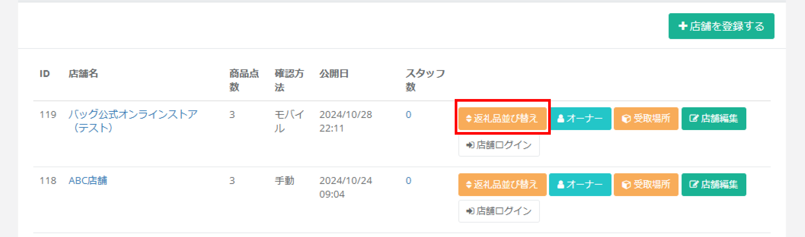
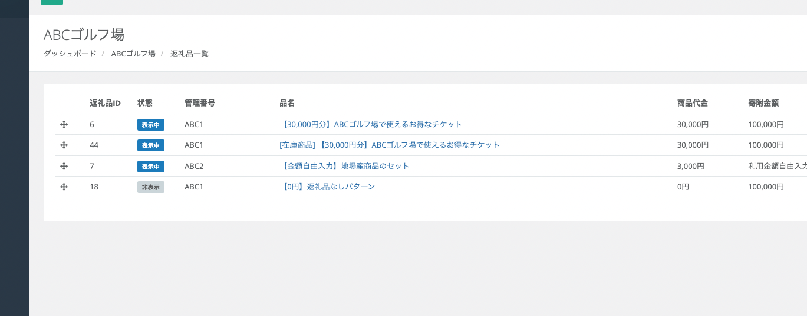

返礼品管理では、ふるさとズに掲載する返礼品の編集や削除、複製、並び替え、  
登録している情報をデータでダウンロードすることが可能です。  

## 返礼品の編集

*返礼品管理画面*

返礼品の内容を編集する場合は、編集をしたい返礼品の **「編集」** ボタンをクリックします。  
編集したい項目を更新後、**「プレビュー」** ボタンをクリックし、別タブで開かれるプレビュー画面を確認します。  
意図した通りの更新が確認できたらプレビュー画面を閉じ、編集画面の **「更新する」** ボタンをクリックして、内容を確定させます。

*編集画面（ページ下部）*

## 返礼品の削除

*返礼品管理画面*

返礼品の削除は、削除したい返礼品の **「編集」** ボタンをクリックします。

*編集画面（ページ上部）*

編集画面が表示されたら、画面右上の **「削除する」** ボタンをクリックします。  
画面上に「本当に削除しますか？」のメッセージが表示されるので、  
問題なければ **「OK」** をクリックして、削除を実行します。

## 返礼品の複製

*返礼品管理画面*

登録されている返礼品は内容の複製が可能です。  
管理画面から複製したい返礼品の **「複製」** ボタンをクリックします。  
「複製しますか？」のメッセージが表示されるので **「OK」** をクリックします。

*複製した返礼品の編集画面（ページ上部）*

複製した返礼品の編集画面が表示されたら、登録したい返礼品の内容を入力します。  
※複製した場合は商品名の先頭に **「［COPY］」** と付与されます。

*編集画面（ページ下部）*

内容の入力ができたら、プレビュー画面で内容を確認します。  
ページ下部の **「プレビュー」** ボタンをクリックし、別タブで開かれるプレビュー画面を確認します。  
内容に問題がなければプレビュー画面を閉じ、  
編集画面の **「更新する」** ボタンをクリックして内容を確定させます。

## 返礼品の並び替え

メニューの「登録店舗」画面から、返礼品を並び替えたい店舗の **「返礼品並び替え」** ボタンをクリックします。

返礼品一覧画面で、返礼品の左端に表示される **十字アイコンをドラッグ** することで並び替えができます。

## 返礼品申請機能

店舗さまの管理画面から返礼品情報を入力して、新たな返礼品を申請することが可能になりました。
店舗さまでの返礼品申請方法は[（店舗向け）返礼品管理マニュアル](/shops/product/)をご確認ください。  

返礼品申請があった場合、自治体さまの管理画面にログインするとお知らせが届きます。  
※お知らせが届くとサイドメニュー「返礼品管理」の右側に赤のアイコンも表示されます。

  

お知らせをクリックすると現在申請されている返礼品が表示されます。  
申請内容を確認するには「編集」ボタンをクリックします。  

編集画面で申請内容を確認後、「受理」「棄却」からお選びいただき、「更新する」ボタンをクリックします。  

　　

:::caution
表示状態が「公開中」になっている場合、「受理」することで掲載が開始されます。  
一度「受理」したものは取り消しができないため、掲載を取りやめたい場合は必ず表示状態を「非表示中」へ変更ください。  
:::