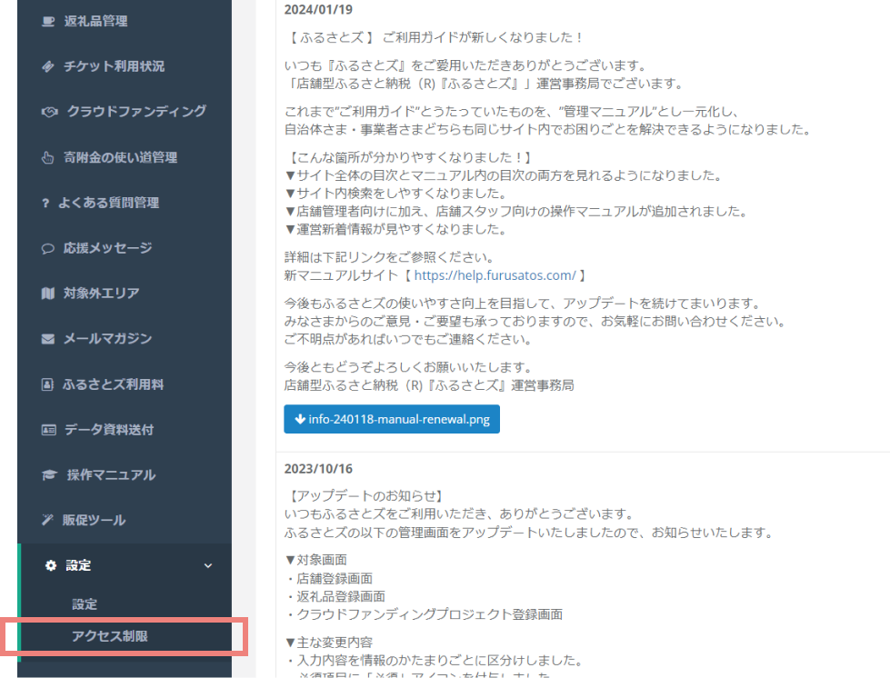
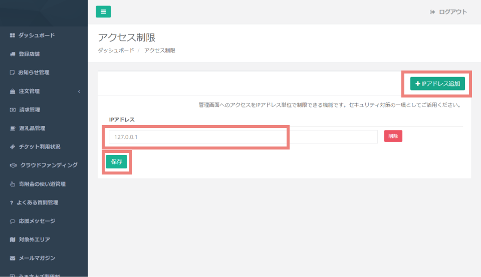
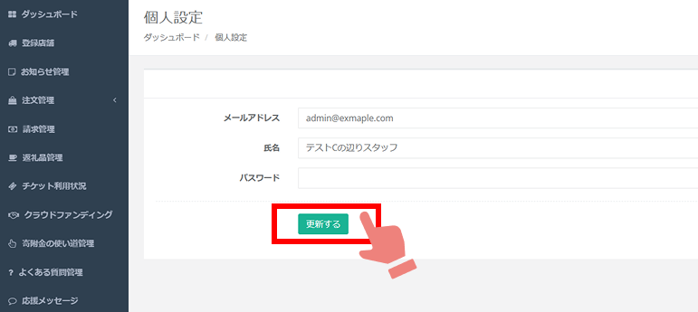

設定画面では、自治体詳細情報や管理画面にログインする際のアクセス制限、現在ログインしているアカウントのパスワード設定、変更が可能です。

## 自治体詳細

自治体さまのロゴ画像やメールの署名を登録することができます。

### ロゴ画像の登録・更新

*設定画面の表示*

ロゴ画像を登録・更新するには、**「ファイルを選択」** をクリックし、登録したい画像を選択します。(JPEG,PNG,PDF形式)  
削除したい場合は **「削除する」** のチェックボックスをクリックし、 **「更新する」** ボタンをクリックすることで削除が可能です。

### 基本情報の登録・更新

*情報入力画面*

ふるさとズを導入していただく際に、運営事務局で初期設定をしておりますが、
更新が必要な場合は必要情報を入力し **「更新する」** をクリックすることで、更新ができます。  

---

## アクセス制限  

管理画面にログインする際、IPアドレスによるアクセス制限の設定ができます。

### 設定方法
1. 設定は管理画面のメニューから、 **「設定＞アクセス制限」** を選択します。  
   

2. **右上の「IPアドレス追加」** を押すと、入力枠が表示されます。  
   **「IPアドレス」** にアクセスを許可したいIPアドレスを入力し、 **「保存」** をクリックします。  
   
   *アクセス制限*

:::caution
システム管理の都合上、アクセス制限をかけた場合もふるさとズ運営会社からはアクセスが可能になっております。予めご了承ください。
:::

---

## 個人設定  

現在、管理画面にログインしているアカウントのパスワード等、更新ができます。  

   *個人設定*

* メールアドレス  
* 氏名  
* パスワード  

変更したい項目を入力し、「更新する」を押します。

