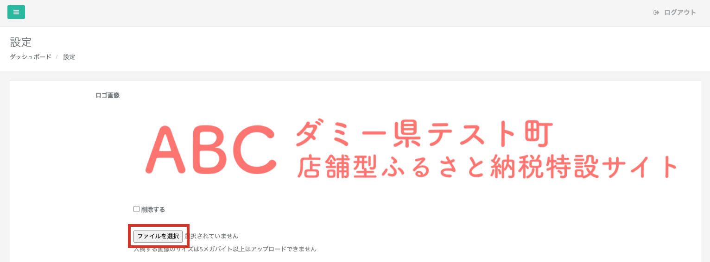
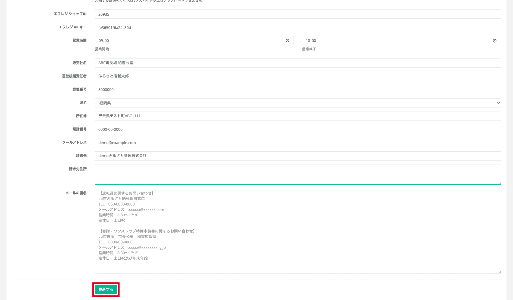

ふるさとズで利用する自治体さまのロゴ画像やメールの署名を登録することができます。

## 情報の登録・更新

### ロゴ画像の登録・更新

*設定画面の表示*

ロゴ画像を登録・更新するには、**「ファイルを選択」** をクリックし、登録したい画像を選択します。(JPEG,PNG,PDF形式)  
削除したい場合は **「削除する」** のチェックボックスをクリックし、 **「更新する」** ボタンをクリックすることで削除が可能です。

### 基本情報の登録・更新

*情報入力画面*

ふるさとズ導入時に初期設定をさせていただきますが、  
更新が必要な場合は必要情報を入力し **「更新する」** をクリックすることで、更新ができます。