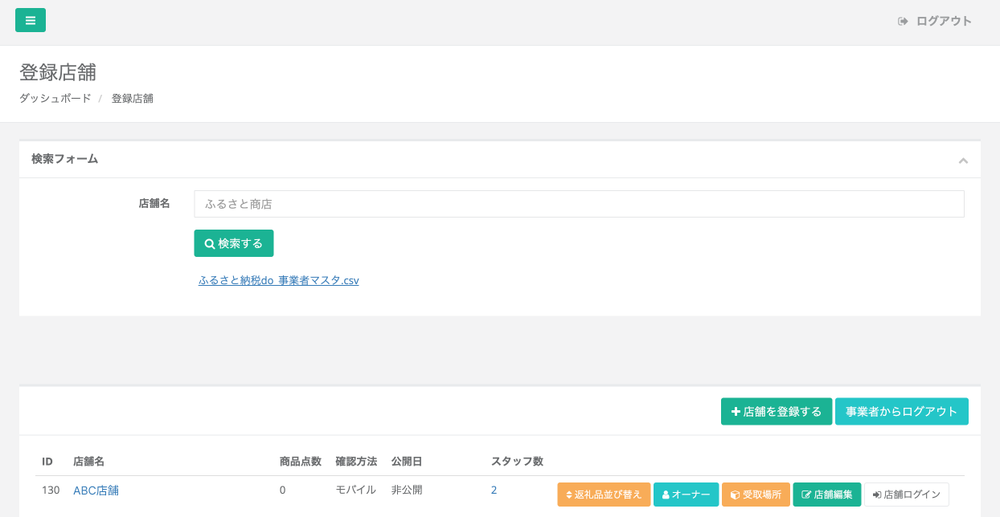
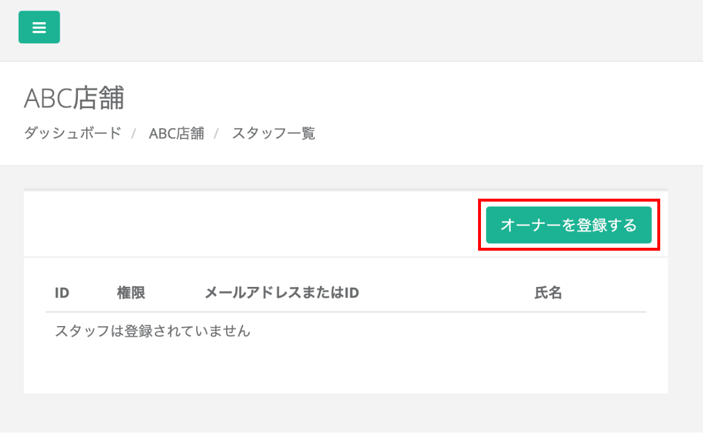

登録店舗は、店舗の新規登録や既存店舗の掲載情報の編集が可能です。  
各店舗のオーナーやスタッフの登録・管理もこちらから行います。

## 店舗の登録

*「登録店舗」画面*

店舗の登録は、メニューの「登録店舗」から店舗一覧画面に遷移し、画面右の **「店舗を登録する」** ボタンをクリックします。  
登録画面が表示されましたら、各項目を入力し、**「登録する」** ボタンをクリックします。  
各項目の説明は以下に記載します。

### 店舗詳細情報

*店舗登録項目1*

- **店舗名**  
店舗名を入力してください。（必須）
- **事業者コード**  
自治体内で管理している事業者コードがあれば、入力が可能です。
- **住所**  
郵便番号と住所を入力してください。
- **電話番号**  
電話番号を入力してください。入力は半角数字でお願いします。
- **Google MAP**  
Google MAPに登録されている場合はURLを入力してください。
- **営業時間**  
固定の営業時間がある場合は開始と終了の時間を入力してください。
- **備考欄（メモ）**  
メモしておくべき事柄がある場合には備考欄に入力してください。

**店舗画像**

*店舗登録項目2*

- **店舗画像**  
店舗の登録が可能です。  
推奨サイズは横800px、縦420px（比率16:9）です。
- **OGP**  
SNSでシェアされた際に表示されるサムネイル画像を設定できます。  
推奨サイズは横1200px、縦630pxです。
- **（販促）チラシデータ**  
販促用のチラシデータがあれば、登録が可能です。

### 機能設定

*機能設定項目*

- **商品引渡時の確認方法（アプリで確認する／アプリを使わず寄附者と一緒に確認する）**  
商品を寄附者へ渡す際の確認方法を選択できます。  
事業者用の確認アプリがありますので、**利用する** または **しない** を選択が可能です。  
初期設定は **「アプリで確認する」** となっています。

- **匿名モード（無効／有効）**  
一覧ページには表示されず、URLを知っているユーザーのみが閲覧できる設定です。  
限定公開したい返礼品などにお使いいただけます。  
初期設定は **「無効」** となっています。

- **配送モード（無効／有効）**  
返礼品を配送前提として受け付ける機能を設定できます。  
有効の場合は、配送前提の返礼品として表示されます。  
初期設定は **「無効」** となっています。

- **決済方法（クレジットカード／クレジットカード・銀行振り込み）**  
寄附の決済方法を設定できます。  
初期設定は **「クレジットカード」** のみとなっています。

**公開日時設定**

*公開日時設定*

- **公開日時**  
公開日時を設定できます。設定しない限りは一般公開されません。

:::caution
公開日時設定を行うまでは下書きになります。  
日付を設定すると、公開日時まではログイン状態でページの確認ができます。  
※公開日時の設定を行わなかった場合、ログイン状態でもエラー表示が出てしまいますのでご注意ください。

:::
## オーナーの登録

*「登録店舗」画面*

店舗の登録後は、その店舗のオーナーアカウントを作成します。  
※オーナーアカウントは寄附者情報をすべて閲覧できるため、店舗の一般従業員の方は次項で説明するスタッフアカウントでご登録ください。

オーナーを登録したい店舗の **「オーナー登録」** ボタンをクリックします。

*「スタッフ一覧」画面*

スタッフ一覧画面が表示されますので、右上の **「オーナーを登録する」** ボタンをクリックします。

*「オーナー登録」画面*

オーナー新規登録画面が表示されますので、登録する方のメールアドレスと氏名、パスワードを入力して **「登録する」** ボタンをクリックします。

## スタッフの登録

*自治体管理サイト「登録店舗」画面*

スタッフの登録は「店舗側のふるさとズ管理サイト」上で、登録を行います。  
自治体ご担当者様は、登録店舗の **「店舗ログイン」** ボタンをクリックすると店舗側の管理画面へと遷移できます。

*店舗側の管理画面*

店舗側の管理画面（背景：水色）が表示されましたら、左側のメニューバーから **「スタッフ管理」** をクリックします。

*スタッフ管理画面*

スタッフ管理画面が表示されましたら、**「スタッフを登録する」** ボタンをクリックします。  
※店舗さま管理画面からは、アプリ利用に必要な権限を持つスタッフのみを追加できます。

*スタッフ登録画面*

メールアドレス・氏名・パスワードを入力し、**「登録する」** ボタンをクリックします。

## スタッフの編集

*スタッフ一覧画面*

スタッフ一覧画面から **「編集」** ボタンをクリックします。

*編集画面*

編集したい箇所を更新し、**「登録する」** ボタンをクリックします。