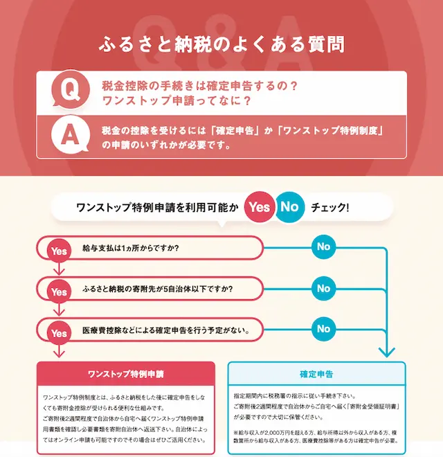

import { LinkCard, CardGrid } from '@astrojs/starlight/components';
import { Tabs, TabItem } from '@astrojs/starlight/components';

いつも店舗型ふるさと納税®『ふるさとズ』をご利用いただき、誠にありがとうございます。  
ふるさとズのロゴや販促ツール等を一覧にしております。  
データをダウンロードいただき、ふるさとズの利用訴求の程よろしくお願いいたします。  
素材の利用に関してはガイドラインをお読みいただき、ご使用ください。

<Tabs>
  <TabItem label="印刷して使う">
  [使用例](#使用例) [寄附者向け販促ツール](#寄附者向け販促ツール) [ロゴ](#ロゴ)
  
		## 使用例
		**店内で掲示するチラシやポスターとして**
		
		チラシやポスターは店内および店頭での掲示にご利用ください。  
		QRコードが記載されているものもありますので、お客様が見やすい・読み取りのしやすい場所での掲示をオススメいたします。

		**既存のお客様へのDMや郵送物の一部として**
		

		既存のお客様（ファン）をお持ちの店舗様につきましては、DMや郵送物の中にお使いいただける小さいサイズの販促ツールも準備しております。  
		同封いただいたり、ロゴ画像をご利用いただき、ふるさとズの利用を案内ください。

			## 寄附者向け販促ツール
			### チラシ・ポスター（A3〜A5）
			

				

					<a href="../../../assets/pdf/202312onestop.pdf" download="202312onestop.pdf">
						
						ワンストップ特例制度、確定申告説明資料  
						サイズA4  
						形式PDF
					</a>
				

				

					<a href="../../../assets/pdf/202312onestop.pdf" download="202312onestop.pdf">
						
						ワンストップ特例制度、確定申告説明資料  
						サイズA4  
						形式PDF
					</a>
				

				

					<a href="../../../assets/pdf/202312onestop.pdf" download="202312onestop.pdf">
						
						ワンストップ特例制度、確定申告説明資料  
						サイズA4  
						形式PDF
					</a>
				

				

					<a href="../../../assets/pdf/202312onestop.pdf" download="202312onestop.pdf">
						
						ワンストップ特例制度、確定申告説明資料  
						サイズA4  
						形式MP4
					</a>
				

				

					<a href="../../../assets/pdf/202312onestop.pdf" download="202312onestop.pdf">
						
						ワンストップ特例制度、確定申告説明資料  
						サイズA4  
						形式MP4
					</a>
				

				

					<a href="../../../assets/pdf/202312onestop.pdf" download="202312onestop.pdf">
						
						ワンストップ特例制度、確定申告説明資料  
						サイズA4  
						形式MP4
					</a>
				

				

					<a href="../../../assets/pdf/202312onestop.pdf" download="202312onestop.pdf">
						
						ワンストップ特例制度、確定申告説明資料  
						サイズA4  
						形式MP4
					</a>
				

				

					<a href="../../../assets/pdf/202312onestop.pdf" download="202312onestop.pdf">
						
						ワンストップ特例制度、確定申告説明資料  
						サイズA4  
						形式MP4
					</a>
				

			

			### その他ツール（ポストカード etc...）
			

				

					<a href="../../../assets/pdf/202312onestop.pdf" download="202312onestop.pdf">
						
						ワンストップ特例制度、確定申告説明資料  
						サイズA4  
						形式PDF
					</a>
				

				

					<a href="../../../assets/pdf/202312onestop.pdf" download="202312onestop.pdf">
						
						ワンストップ特例制度、確定申告説明資料  
						サイズA4  
						形式PDF
					</a>
				

				

					<a href="../../../assets/pdf/202312onestop.pdf" download="202312onestop.pdf">
						
						ワンストップ特例制度、確定申告説明資料  
						サイズA4  
						形式PDF
					</a>
				

			

			## ロゴ
			### ガイドライン
			

				

					<a href="../../../assets/pdf/202312onestop.pdf" download="202312onestop.pdf">
						
						ワンストップ特例制度、確定申告説明資料  
						サイズA4  
						形式PDF
					</a>
				

			

			### ロゴマーク（印刷用／CMYK）
			

				

					<a href="../../../assets/pdf/202312onestop.pdf" download="202312onestop.pdf">
						
						ワンストップ特例制度、確定申告説明資料  
						サイズA4  
						形式PDF
					</a>
				

				

					<a href="../../../assets/pdf/202312onestop.pdf" download="202312onestop.pdf">
						
						ワンストップ特例制度、確定申告説明資料  
						サイズA4  
						形式PDF
					</a>
				

				

					<a href="../../../assets/pdf/202312onestop.pdf" download="202312onestop.pdf">
						
						ワンストップ特例制度、確定申告説明資料  
						サイズA4  
						形式PDF
					</a>
				

				

					<a href="../../../assets/pdf/202312onestop.pdf" download="202312onestop.pdf">
						
						ワンストップ特例制度、確定申告説明資料  
						サイズA4  
						形式PDF
					</a>
				

			

  </TabItem>
  <TabItem label="Webで使う">
  いいい
  </TabItem>
</Tabs>

<section id="top-index">
## お知らせ
お知らせ2023/10/24｜[ふるさとズが第25回福岡デザインアワードを受賞しました！](./info/231024-design-award/)  
お知らせ2023/05/19｜[ふるさとズは、ビジネスモデル特許を取得いたしました。](./info/230519-business-model/)

<section class="section-wrap">
	## 管理画面マニュアル
	<LinkCard title="自治体関係者向け" href="./lg/" />

	<CardGrid>
		<LinkCard title="店舗管理者向け" href="./shops/" />
		<LinkCard title="店舗スタッフ向け" href="./staff/staff/" />
	</CardGrid>
</section>

<section class="section-wrap">
	## よくある質問
	

		<LinkCard title="Q.電子チケットの確認方法が知りたい" href="./lg/e-ticket/" />
	

	[よくある質問一覧を見る](./faq/)
</section>

<section class="section-wrap">
	## リリースノート・お役立ちツール
	<CardGrid>
		<LinkCard title="リリースノート" description="現在準備中です。" href="" />
		<LinkCard title="お役立ちツール" description="販促にご利用いただけるツールを配布しています。" href="https://promotion-tool.furusatos.com/" target="_blank" />
	</CardGrid>
</section>
</section>

