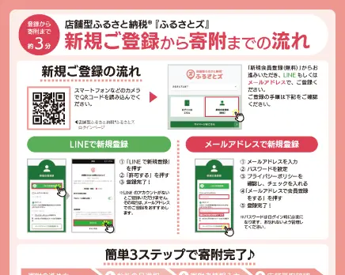
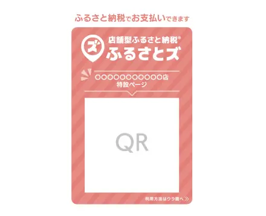
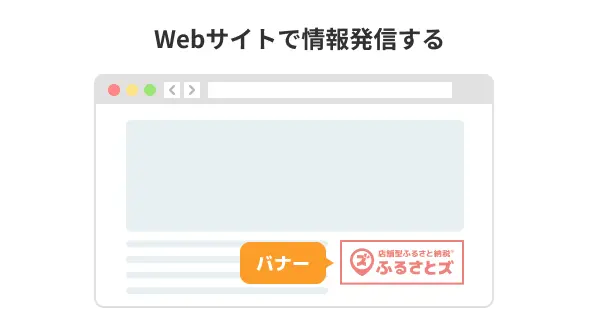

import { LinkCard, CardGrid } from '@astrojs/starlight/components';
import { Tabs, TabItem } from '@astrojs/starlight/components';
import { Icon } from '@astrojs/starlight/components';

いつも店舗型ふるさと納税®『ふるさとズ』をご利用いただき、誠にありがとうございます。  
ふるさとズのロゴや販促ツール等を一覧にしております。  
データをダウンロードいただき、ふるさとズの利用訴求の程よろしくお願いいたします。  
素材の利用に関してはガイドラインをお読みいただき、ご使用ください。

<Tabs>
  <TabItem label="印刷して使う">
  
[使用例<Icon name="down-caret" size="1.3rem" />](#印刷時の使用例) [寄附者向け販促ツール<Icon name="down-caret" size="1.3rem" />](#寄附者向け販促ツール) [ロゴ<Icon name="down-caret" size="1.3rem" />](#ロゴ)

  
		## 印刷時の使用例
		**店内で掲示するチラシやポスターとして**
		

			

				
			

			

				チラシやポスターは店内および店頭での掲示にご利用ください。  
				QRコードが記載されているものもありますので、お客様が見やすい・読み取りのしやすい場所での掲示をオススメいたします。
			

		

		**既存のお客様へのDMや郵送物の一部として**
		

			

				
			

			

				既存のお客様（ファン）をお持ちの店舗様につきましては、DMや郵送物の中にお使いいただける小さいサイズの販促ツールも準備しております。  
				同封いただいたり、ロゴ画像をご利用いただき、ふるさとズの利用を案内ください。
			

		

			## 寄附者向け販促ツール
			### チラシ・ポスター（A3〜A5）
			

				

					<a href="../../../assets/pdf/202312onestop.pdf" download="202312onestop.pdf">
						
						ワンストップ特例制度、確定申告説明資料  
						サイズA4  
						形式PDF
					</a>
				

				

					<a href="../../../assets/pdf/furusato_seidosetsumei_ver01.pdf" download="furusato_seidosetsumei_ver01.pdf">
						
						ふるさと納税制度説明チラシ  
						サイズA4  
						形式PDF
					</a>
				

				

					<a href="../../../assets/pdf/furusatos_guidance_ver01.pdf" download="furusatos_guidance_ver01.pdf">
						
						ふるさとズ登録ガイダンス  
						サイズA4  
						形式PDF
					</a>
				

				

					<a href="../../../assets/ppt/A4_tenpo_PowerPoint_template_ver2.pptx" download="A4_tenpo_PowerPoint_template_ver2.pptx">
						
						店舗用チラシテンプレート  
						サイズA4  
						形式PowerPoint
					</a>
				

				

					<a href="../../../assets/ppt/A4_tenpo_PowerPoint_template_kingakuziyu_ver1.pptx" download="A4_tenpo_PowerPoint_template_kingakuziyu_ver1.pptx">
						
						【金額自由入力】店舗用チラシテンプレート  
						サイズA4  
						形式PowerPoint
					</a>
				

				

					<a href="../../../assets/ppt/A4_tenpo_PowerPoint_template_denshi_ver1.pptx" download="A4_tenpo_PowerPoint_template_denshi_ver1.pptx">
						
						【電子チケット】店舗用チラシテンプレート  
						サイズA4  
						形式PowerPoint
					</a>
				

				
				{/* 

					<a href="../../../assets/pdf/202312onestop.pdf" download="202312onestop.pdf">
						
						キャンペーンチラシ  
						サイズA4  
						形式PDF  
						期間11/20〜12/20  
						対象寄附者さま
					</a>
				

				

					<a href="../../../assets/pdf/202312onestop.pdf" download="202312onestop.pdf">
						
						キャンペーンチラシ  
						サイズA3  
						形式PDF  
						期間11/20〜12/20  
						対象寄附者さま
					</a>
				
 */}

			

			### その他ツール（ポストカード etc...）
			

				

					<a href="../../../assets/ppt/ポストカード_スタンダードver_20221128.pptx" download="ポストカード_スタンダードver_20221128.pptx">
						
						ポストカード（スタンダード）  
						サイズ100mm×148mm  
						形式PowerPoint(.pptx)
					</a>
				

				

					<a href="../../../assets/ppt/ポストカード_マップピンver_20221128.pptx" download="ポストカード_マップピンver_20221128.pptx">
						
						ポストカード（マップピン）  
						サイズ100mm×148mm  
						形式PowerPoint(.pptx)
					</a>
				

				

					<a href="../../../assets/ppt/ミニ三角POP_20221128.pptx" download="ミニ三角POP_20221128.pptx">
						
						三角POP（ミニ）  
						サイズ89mm×85mm  
						形式PowerPoint(.pptx)
					</a>
				

			

			## ロゴ
			### ガイドライン
			

				

					<a href="../../../assets/pdf/furusatos_logoguideline_ver01.pdf" download="furusatos_logoguideline_ver01.pdf">
						
						ふるさとズロゴガイドライン  
						サイズA4  
						形式PDF
					</a>
				

			

			### ロゴマーク（印刷用／CMYK）
			

				

					<a href="../../../assets/logo/print_logo_x01.jpg" download="print_logo_x01.jpg">
						
						ロゴ横組み1  
						形式JPG
					</a>
				

				

					<a href="../../../assets/logo/print_logo_x02.jpg" download="print_logo_x02.jpg">
						
						ロゴ横組み2  
						形式JPG
					</a>
				

				

					<a href="../../../assets/logo/print_logo_y01.jpg" download="print_logo_y01.jpg">
						
						ロゴ縦組み1  
						形式JPG
					</a>
				

				

					<a href="../../../assets/logo/print_logo_y02.jpg" download="print_logo_y02.jpg">
						
						ロゴ縦組み2  
						形式JPG
					</a>
				

				

					<a href="../../../assets/logo/print_logo_symbol.jpg" download="print_logo_symbol.jpg">
						
						ロゴシンボルマーク  
						形式JPG
					</a>
				

				

					<a href="../../../assets/logo/print_white_logo_x01.jpg" download="print_white_logo_x01.jpg">
						
						ロゴ横組み1（白）  
						形式JPG
					</a>
				

				

					<a href="../../../assets/logo/print_white_logo_x02.jpg" download="print_white_logo_x02.jpg">
						
						ロゴ横組み2（白）  
						形式JPG
					</a>
				

				

					<a href="../../../assets/logo/print_white_logo_y01.jpg" download="print_white_logo_y01.jpg">
						
						ロゴ縦組み1（白）  
						形式JPG
					</a>
				

				

					<a href="../../../assets/logo/print_white_logo_y02.jpg" download="print_white_logo_y02.jpg">
						
						ロゴ縦組み2（白）  
						形式JPG
					</a>
				

				

					<a href="../../../assets/logo/print_white_logo_symbol.jpg" download="print_white_logo_symbol.jpg">
						
						ロゴシンボルマーク（白）  
						形式JPG
					</a>
				

			

  </TabItem>
  <TabItem label="Webで使う">
  	
[使用例<Icon name="down-caret" size="1.3rem" />](#Web上での使用例) [寄附者向け販促ツール<Icon name="down-caret" size="1.3rem" />](#Web用販促ツール) [ロゴ<Icon name="down-caret" size="1.3rem" />](#ロゴ)

		## Web上での使用例
		**SNSでの情報発信として**
		

			

				
			

			

				店舗でお持ちのSNSアカウント（Twitter、Instagram、Facebook等）がございましたら、ふるさとズを導入した旨を投稿することをオススメしております。  
				投稿にお使いいただける画像をご用意しておりますので、積極的に活用ください。
			

		

		**Webサイトでの情報発信として**
		

			

				
			

			

				店舗のWebサイトをお持ちの場合は、Webサイト上に設置できるように画像を用意しております。  
				ふるさとズの店舗ページへとご案内し、寄附の促進にお役立てください。
			

		

		## Web用販促ツール
		### 動画
			

				

					<a href="../../../assets/movie/22_寄附者さま向け紹介動画.mp4" download="22_寄附者さま向け紹介動画.mp4">
						
						ふるさとズ 寄附者様向け紹介動画  
						形式MP4
					</a>
				

			

		### バナー
			

				

					<a href="../../../assets/bnr/web_bnr01_320_140.png" download="web_bnr01_320_140.png">
						
						ふるさとズバナー  
						サイズ320×140  
						形式PNG
					</a>
				

				

					<a href="../../../assets/bnr/web_illust_bnr01_980_395.png" download="web_illust_bnr01_980_395.png">
						
						ふるさとズイラストバナー  
						サイズ980×395  
						形式PNG
					</a>
				

			

		### SNS用画像
			

				

					<a href="../../../assets/bnr/web_sns_bnr01_1200_900.png" download="web_sns_bnr01_1200_900.png">
						
						ふるさとズSNS用バナー  
						サイズ1200×600  
						形式PNG
					</a>
				

			

			## ロゴ
			### ガイドライン
			

				

					<a href="../../../assets/pdf/furusatos_logoguideline_ver01.pdf" download="furusatos_logoguideline_ver01.pdf">
						
						ふるさとズロゴガイドライン  
						サイズA4  
						形式PDF
					</a>
				

			

			### ロゴマーク（Web用／RGB）
			

				

					<a href="../../../assets/logo/web_logo_x01.png" download="web_logo_x01.png">
						
						ロゴ横組み1  
						形式PNG
					</a>
				

				

					<a href="../../../assets/logo/web_logo_x02.png" download="web_logo_x02.png">
						
						ロゴ横組み2  
						形式PNG
					</a>
				

				

					<a href="../../../assets/logo/web_logo_y01.png" download="web_logo_y01.png">
						
						ロゴ縦組み1  
						形式PNG
					</a>
				

				

					<a href="../../../assets/logo/web_logo_y02.png" download="web_logo_y02.png">
						
						ロゴ縦組み2  
						形式PNG
					</a>
				

				

					<a href="../../../assets/logo/web_logo_symbol.png" download="web_logo_symbol.png">
						
						ロゴシンボルマーク  
						形式PNG
					</a>
				

				

					<a href="../../../assets/logo/web_white_logo_x01.png" download="web_white_logo_x01.png">
						
						ロゴ横組み1（白）  
						形式PNG
					</a>
				

				

					<a href="../../../assets/logo/web_white_logo_x02.png" download="web_white_logo_x02.png">
						
						ロゴ横組み2（白）  
						形式PNG
					</a>
				

				

					<a href="../../../assets/logo/web_white_logo_y01.png" download="web_white_logo_y01.png">
						
						ロゴ縦組み1（白）  
						形式PNG
					</a>
				

				

					<a href="../../../assets/logo/web_white_logo_y02.png" download="web_white_logo_y02.png">
						
						ロゴ縦組み2（白）  
						形式PNG
					</a>
				

				

					<a href="../../../assets/logo/web_white_logo_symbol.png" download="web_white_logo_symbol.png">
						
						ロゴシンボルマーク（白）  
						形式PNG
					</a>
				

			

  </TabItem>
</Tabs>