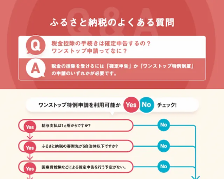

import { LinkCard, CardGrid } from '@astrojs/starlight/components';
import { Tabs, TabItem } from '@astrojs/starlight/components';

いつも店舗型ふるさと納税®『ふるさとズ』をご利用いただき、誠にありがとうございます。  
ふるさとズのロゴや販促ツール等を一覧にしております。  
データをダウンロードいただき、ふるさとズの利用訴求の程よろしくお願いいたします。  
素材の利用に関してはガイドラインをお読みいただき、ご使用ください。

<Tabs>
  <TabItem label="印刷して使う">
  
[使用例 &#9660;](#使用例) [寄附者向け販促ツール &#9660;](#寄附者向け販促ツール) [ロゴ &#9660;](#ロゴ)

  
		## 使用例
		**店内で掲示するチラシやポスターとして**
		

			

				
			

			

				チラシやポスターは店内および店頭での掲示にご利用ください。  
				QRコードが記載されているものもありますので、お客様が見やすい・読み取りのしやすい場所での掲示をオススメいたします。
			

		

		**既存のお客様へのDMや郵送物の一部として**
		

			

				
			

			

				既存のお客様（ファン）をお持ちの店舗様につきましては、DMや郵送物の中にお使いいただける小さいサイズの販促ツールも準備しております。  
				同封いただいたり、ロゴ画像をご利用いただき、ふるさとズの利用を案内ください。
			

		

			## 寄附者向け販促ツール
			### チラシ・ポスター（A3〜A5）
			

				

					<a href="../../../assets/pdf/202312onestop.pdf" download="202312onestop.pdf">
						
						ワンストップ特例制度、確定申告説明資料  
						サイズA4  
						形式PDF
					</a>
				

				

					<a href="../../../assets/pdf/202312onestop.pdf" download="202312onestop.pdf">
						
						ワンストップ特例制度、確定申告説明資料  
						サイズA4  
						形式PDF
					</a>
				

				

					<a href="../../../assets/pdf/202312onestop.pdf" download="202312onestop.pdf">
						
						ワンストップ特例制度、確定申告説明資料  
						サイズA4  
						形式PDF
					</a>
				

				

					<a href="../../../assets/pdf/202312onestop.pdf" download="202312onestop.pdf">
						
						ワンストップ特例制度、確定申告説明資料  
						サイズA4  
						形式MP4
					</a>
				

				

					<a href="../../../assets/pdf/202312onestop.pdf" download="202312onestop.pdf">
						
						ワンストップ特例制度、確定申告説明資料  
						サイズA4  
						形式MP4
					</a>
				

				

					<a href="../../../assets/pdf/202312onestop.pdf" download="202312onestop.pdf">
						
						ワンストップ特例制度、確定申告説明資料  
						サイズA4  
						形式MP4
					</a>
				

				

					<a href="../../../assets/pdf/202312onestop.pdf" download="202312onestop.pdf">
						
						ワンストップ特例制度、確定申告説明資料  
						サイズA4  
						形式MP4
					</a>
				

				

					<a href="../../../assets/pdf/202312onestop.pdf" download="202312onestop.pdf">
						
						ワンストップ特例制度、確定申告説明資料  
						サイズA4  
						形式MP4
					</a>
				

			

			### その他ツール（ポストカード etc...）
			

				

					<a href="../../../assets/pdf/202312onestop.pdf" download="202312onestop.pdf">
						
						ワンストップ特例制度、確定申告説明資料  
						サイズA4  
						形式PDF
					</a>
				

				

					<a href="../../../assets/pdf/202312onestop.pdf" download="202312onestop.pdf">
						
						ワンストップ特例制度、確定申告説明資料  
						サイズA4  
						形式PDF
					</a>
				

				

					<a href="../../../assets/pdf/202312onestop.pdf" download="202312onestop.pdf">
						
						ワンストップ特例制度、確定申告説明資料  
						サイズA4  
						形式PDF
					</a>
				

			

			## ロゴ
			### ガイドライン
			

				

					<a href="../../../assets/pdf/202312onestop.pdf" download="202312onestop.pdf">
						
						ワンストップ特例制度、確定申告説明資料  
						サイズA4  
						形式PDF
					</a>
				

			

			### ロゴマーク（印刷用／CMYK）
			

				

					<a href="../../../assets/pdf/202312onestop.pdf" download="202312onestop.pdf">
						
						ワンストップ特例制度、確定申告説明資料  
						サイズA4  
						形式PDF
					</a>
				

				

					<a href="../../../assets/pdf/202312onestop.pdf" download="202312onestop.pdf">
						
						ワンストップ特例制度、確定申告説明資料  
						サイズA4  
						形式PDF
					</a>
				

				

					<a href="../../../assets/pdf/202312onestop.pdf" download="202312onestop.pdf">
						
						ワンストップ特例制度、確定申告説明資料  
						サイズA4  
						形式PDF
					</a>
				

				

					<a href="../../../assets/pdf/202312onestop.pdf" download="202312onestop.pdf">
						
						ワンストップ特例制度、確定申告説明資料  
						サイズA4  
						形式PDF
					</a>
				

			

  </TabItem>
  <TabItem label="Webで使う">
  	
[使用例 &#9660;](#使用例) [寄附者向け販促ツール &#9660;](#寄附者向け販促ツール) [ロゴ &#9660;](#ロゴ)

  </TabItem>
</Tabs>