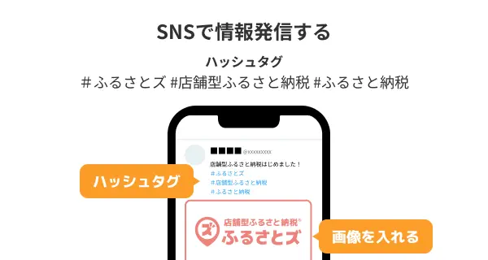
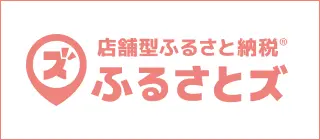
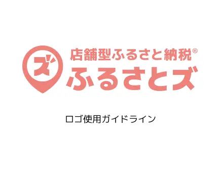
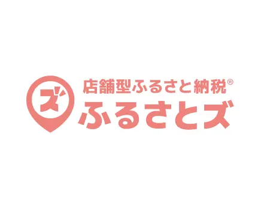
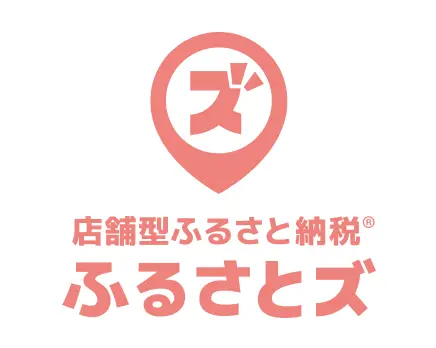
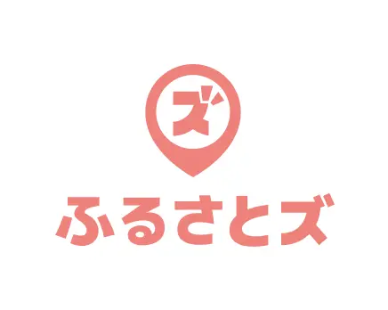
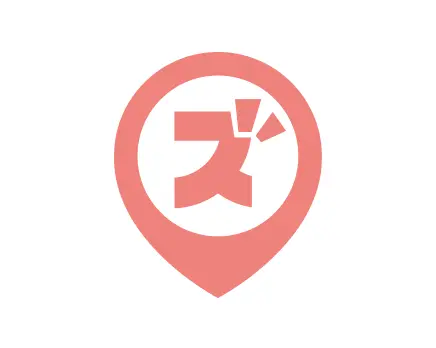
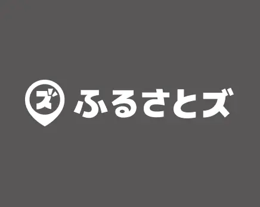
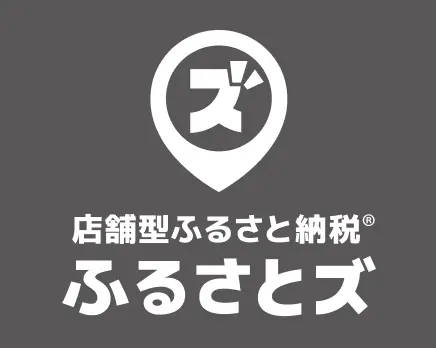

import { LinkCard, CardGrid } from '@astrojs/starlight/components';
import { Tabs, TabItem } from '@astrojs/starlight/components';
import { Icon } from '@astrojs/starlight/components';

<section class="pt_content_wrap">
いつも店舗型ふるさと納税®『ふるさとズ』をご利用いただき、誠にありがとうございます。  
ふるさとズのロゴや販促ツール等を一覧にしております。  
データをダウンロードいただき、ふるさとズの利用訴求の程よろしくお願いいたします。  
素材の利用に関してはガイドラインをお読みいただき、ご使用ください。

	

		<a class="tab_btn" href=".././">印刷して使う</a>
		<a class="tab_btn active" href="./web-assets/">Webで使う</a>
	

  	
[使用例<Icon name="down-caret" size="1.3rem" />](#使用例) [寄附者向け販促ツール<Icon name="down-caret" size="1.3rem" />](#寄附者向け販促ツール) [ロゴ<Icon name="down-caret" size="1.3rem" />](#ロゴ)

		## 使用例
		**SNSでの情報発信として**
		

			

				
			

			

				店舗でお持ちのSNSアカウント（Twitter、Instagram、Facebook等）がございましたら、ふるさとズを導入した旨を投稿することをオススメしております。  
				投稿にお使いいただける画像をご用意しておりますので、積極的に活用ください。
			

		

		**Webサイトでの情報発信として**
		

			

				
			

			

				店舗のWebサイトをお持ちの場合は、Webサイト上に設置できるように画像を用意しております。  
				ふるさとズの店舗ページへとご案内し、寄附の促進にお役立てください。
			

		

		## 寄附者向け販促ツール
		###	アプリ
			

				

					<a href="../../../apk/furusatos.apk" download="furusatos.apk">
						
						ふるさとズ Androidアプリ  
						形式APKファイル
					</a>
				

			

		### 動画
			

				

					<a href="../../../movie/22_寄附者さま向け紹介動画.mp4" download="22_寄附者さま向け紹介動画.mp4">
						
						ふるさとズ 寄附者様向け紹介動画  
						形式MP4
					</a>
				

			

		### バナー
			

				

					<a href="../../../bnr/web_bnr01_320_140.png" download="web_bnr01_320_140.png">
						
						ふるさとズバナー  
						サイズ320×140  
						形式PNG
					</a>
				

				

					<a href="../../../bnr/web_illust_bnr01_980_395.png" download="web_illust_bnr01_980_395.png">
						
						ふるさとズイラストバナー  
						サイズ980×395  
						形式PNG
					</a>
				

			

			

				

					<a href="../../../bnr/pt_web_bnr_furusatoz-480_120.jpg" download="pt_web_bnr_furusatoz-480_120.jpg">
						
						ふるさと納税 お支払い  
						サイズ480×120  
						形式JPG
					</a>
				

				

					<a href="../../../bnr/pt_web_bnr_beginner-flow_480_120.jpg" download="pt_web_bnr_beginner-flow_480_120.jpg">
						
						ふるさと納税 支払手順  
						サイズ480×120  
						形式JPG
					</a>
				

			

		### SNS用画像
			

				

					<a href="../../../bnr/web_sns_bnr01_1200_900.png" download="web_sns_bnr01_1200_900.png">
						
						ふるさとズSNS用バナー  
						サイズ1200×600  
						形式PNG
					</a>
				

			

			## ロゴ
			### ガイドライン
			

				

					<a href="../../../pdf/furusatos_logoguideline_ver01.pdf" download="furusatos_logoguideline_ver01.pdf">
						
						ふるさとズロゴガイドライン  
						サイズA4  
						形式PDF
					</a>
				

			

			### ロゴマーク（Web用／RGB）
			

				

					<a href="../../../logo/web_logo_x01.png" download="web_logo_x01.png">
						
						ロゴ横組み1  
						形式PNG
					</a>
				

				

					<a href="../../../logo/web_logo_x02.png" download="web_logo_x02.png">
						
						ロゴ横組み2  
						形式PNG
					</a>
				

				

					<a href="../../../logo/web_logo_y01.png" download="web_logo_y01.png">
						
						ロゴ縦組み1  
						形式PNG
					</a>
				

				

					<a href="../../../logo/web_logo_y02.png" download="web_logo_y02.png">
						
						ロゴ縦組み2  
						形式PNG
					</a>
				

				

					<a href="../../../logo/web_logo_symbol.png" download="web_logo_symbol.png">
						
						ロゴシンボルマーク  
						形式PNG
					</a>
				

				

					<a href="../../../logo/web_white_logo_x01.png" download="web_white_logo_x01.png">
						
						ロゴ横組み1（白）  
						形式PNG
					</a>
				

				

					<a href="../../../logo/web_white_logo_x02.png" download="web_white_logo_x02.png">
						
						ロゴ横組み2（白）  
						形式PNG
					</a>
				

				

					<a href="../../../logo/web_white_logo_y01.png" download="web_white_logo_y01.png">
						
						ロゴ縦組み1（白）  
						形式PNG
					</a>
				

				

					<a href="../../../logo/web_white_logo_y02.png" download="web_white_logo_y02.png">
						
						ロゴ縦組み2（白）  
						形式PNG
					</a>
				

				

					<a href="../../../logo/web_white_logo_symbol.png" download="web_white_logo_symbol.png">
						
						ロゴシンボルマーク（白）  
						形式PNG
					</a>
				

			

</section>