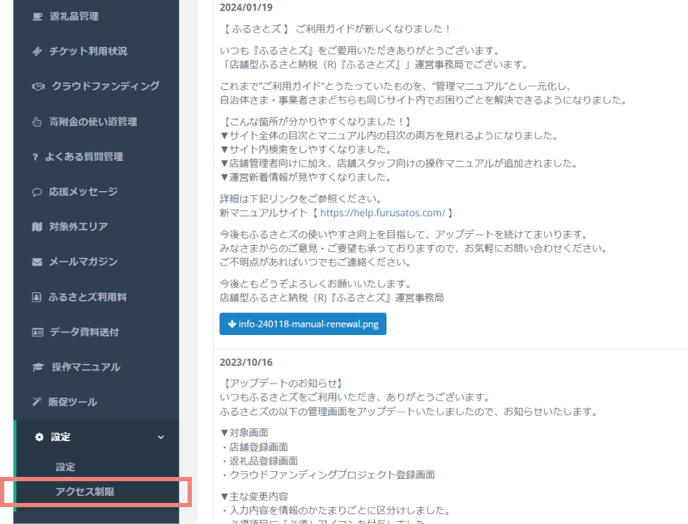

import { LinkCard, CardGrid } from '@astrojs/starlight/components';

## 新機能
### IPアドレスによるアクセス制限ができるようになりました
自治体・店舗管理画面からIPアドレスによるアクセス制限の設定ができるようになりました。  
初期設定は **制限なし** になっています。

#### 設定方法
##### 自治体管理画面での設定
1. 設定は管理画面のメニューから、 **「設定＞アクセス制限」** を選択します。  
   

2. 設定画面が表示されたら、 **右上の「IPアドレス追加」** をクリックします。  
   表示される枠に **「アクセスを許可するIPアドレス」** を入力し、 **「保存」** をクリックします。  
   
   *自治体管理画面*

##### 店舗管理画面での設定
1. 設定は管理画面のメニューから、 **「アクセス制限」** を選択します。  
2. 設定画面が表示されたら、 **右上の「IPアドレス追加」** をクリックします。  
   表示される枠に **「アクセスを許可する」** IPアドレスを入力し、 **「保存」** をクリックします。  
   
   *店舗管理画面*

:::caution
システム管理の都合上、アクセス制限をかけた場合もふるさとズ運営会社からはアクセスが可能になっております。予めご了承ください。
:::
