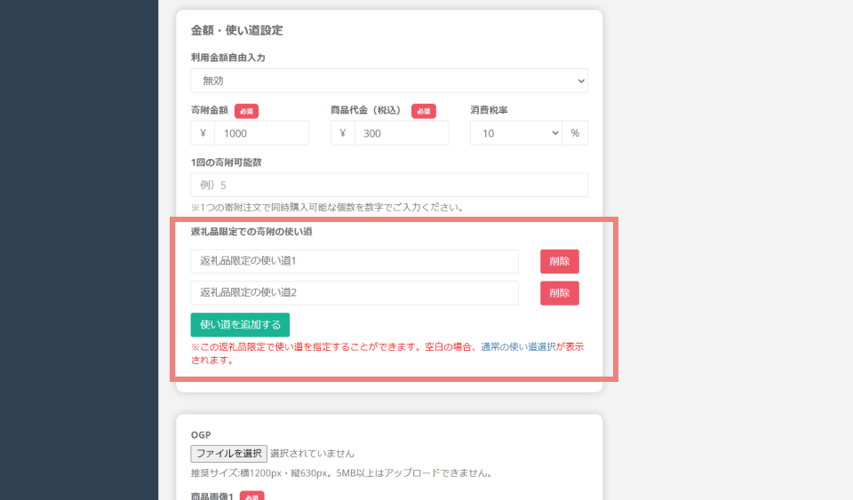

import { LinkCard, CardGrid } from '@astrojs/starlight/components';

## 新機能
### 個別の寄附の使い道を複数設定できるようになりました
ふるさとズでは、返礼品個別の寄附の使い道を **複数設定** できるようになりました。  
初期設定では個別の使い道は設定されておらず、「寄附金の使い道管理」で登録されている共通の使い道が表示されます。

#### 設定方法
1. 設定は返礼品管理ページで行えます。  
   管理画面のメニューから、 **「返礼品管理」** を選択し、個別の寄附金の使い道を設定したい返礼品の編集画面に進みます。  
   編集画面の **「金額・使い道設定」** 内の **「返礼品限定での寄附の使い道」** に個別の使い道を設定します。  
   
   *返礼品管理画面*

<LinkCard
  title="関連コンテンツ｜返礼品を管理する"
  href="/lg/product/"
/>