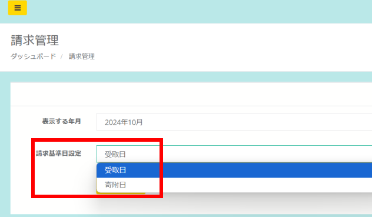

import { LinkCard, CardGrid } from '@astrojs/starlight/components';

### 請求基準日設定が「受取日」「寄附日」から選択が可能となりました  

いつも店舗型ふるさと納税®ふるさとズをご愛用いただきまして誠にありがとうございます。  

請求書に計上する基準を「受取日」「寄附日」から選択が可能となりました。  

*請求基準日設定*

以前までは、返礼品の「受取日」基準で請求書が作成される仕様でしたが、ご希望にあわせて選択が可能となりました。  
・「受取日」返礼品を寄附者にお渡しし、受取済みの処理を実施した日  
・「寄附日」寄附者がお申し込みをして入金を完了した日  

操作方法はヘルプサイトの店舗管理者向け[請求管理マニュアル](/shops/claim/)からご確認ください。  

本機能に関してご質問やご不明な点がございましたら運営事務局までご連絡ください。  
今後とも何卒よろしくお願い申し上げます。  

店舗型ふるさと納税（R)『ふるさとズ』」運営事務局  
電話番号：050-5444-4054  
メールアドレス：contact@furusatos.com  
営業時間：8時30分～17時30分  

<LinkCard
  title="関連コンテンツ｜請求管理"
  href="/shops/claim/"
/>