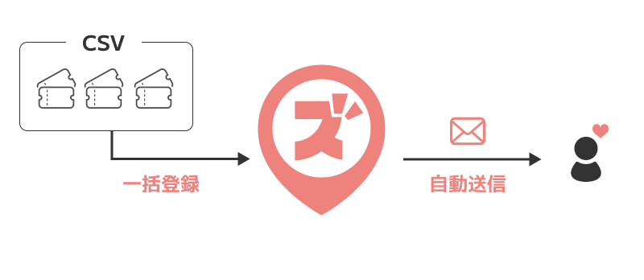
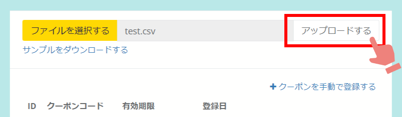
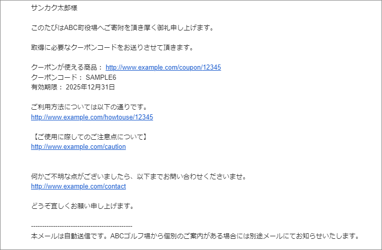

import { LinkCard, CardGrid } from '@astrojs/starlight/components';

## オンラインクーポンが一括登録・自動送信できるようになります！

### クーポンコードの一括登録が可能になります
従来のオンラインクーポン機能では寄附受付ごとに注文詳細画面からメール機能を用いて、
ECサイト側で発行したクーポンコードを送付するオペレーションのみでした。

今回のアップデートでは、予めECサイト側でクーポンコードを多数発行しておき、
ふるさとズ側へCSVで一括登録が可能になります。

&nbsp;

### 寄附者へクーポンコードが自動送信されます
ふるさとズに登録されたクーポンコードは、寄附受付と同時に自動送信されます。  
これにより金額固定のクーポンは都度手動送信していた手間が省け、寄附者の手元にもすぐ届くことで快適な購入体験を提供できます。

*自動送信メール例*

&nbsp;

## 設定方法
リリース後に設定方法のマニュアルを追加予定です。

&nbsp;

<LinkCard
  title="関連コンテンツ｜返礼品を管理する"
  href="/lg/product/"
/>