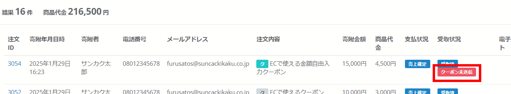

import { LinkCard, CardGrid } from '@astrojs/starlight/components';

### オンラインクーポン「金額自由入力」のメール送信状況が注文一覧で確認できるようになりました

いつも店舗型ふるさと納税®ふるさとズをご愛用いただきまして誠にありがとうございます。  

オンラインクーポン「金額自由入力」の返礼品では、寄附者に管理画面から手動でクーポンコードをメール送信する必要があります。  
メールが送信されているのか、注文管理画面の一覧で確認が可能となりました。  

▼メールが未送信の場合「クーポン未送信」のアイコンが「受取状況」項目に表示

*注文管理画面*  

本リリースに関してご質問やご不明な点がございましたら運営事務局までご連絡ください。  
今後とも何卒よろしくお願い申し上げます。  

店舗型ふるさと納税（R)『ふるさとズ』」運営事務局  
電話番号：050-5444-4054  
メールアドレス：contact@furusatos.com  
営業時間：8時30分～17時30分  

<LinkCard
  title="関連コンテンツ｜オンラインクーポンの登録"
  href="/shops/online-coupon/"
/>