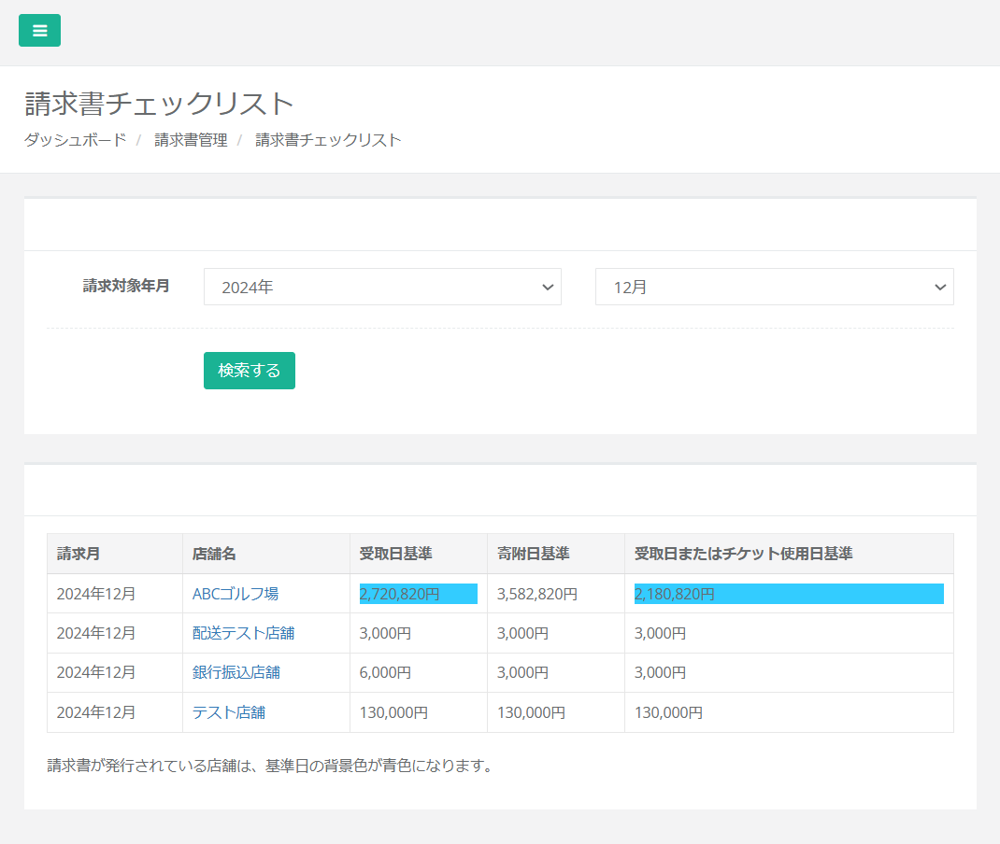

import { LinkCard, CardGrid } from '@astrojs/starlight/components';

### 請求対象の店舗が一覧で確認できるようになりました

いつも店舗型ふるさと納税®ふるさとズをご愛用いただきまして誠にありがとうございます。  

請求対象の店舗が一覧で確認できるようになりました。  
店舗へ送る支払通知書を作成する際、請求処理時の確認用として、ご活用ください。

「請求管理」→「店舗別請求書一覧」→「請求書チェックリスト」を押すと、請求対象年月の請求対象店舗が一覧で表示されます。  

*請求書チェックリスト*  

詳細な内容は自治体様向けマニュアルの[「請求管理」](/lg/claim/#請求書チェックリスト)からご確認いただけます。

本リリースに関してご質問やご不明な点がございましたら運営事務局までご連絡ください。  
今後とも何卒よろしくお願い申し上げます。  

店舗型ふるさと納税（R)『ふるさとズ』」運営事務局  
電話番号：050-5444-4054  
メールアドレス：contact@furusatos.com  
営業時間：8時30分～17時30分  

<LinkCard
  title="関連コンテンツ｜請求管理"
  href="/lg/claim/"
/>