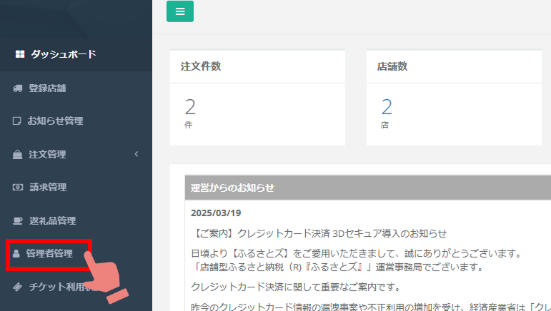

import { LinkCard, CardGrid } from '@astrojs/starlight/components';

### 自治体さま管理画面にログインできるアカウントの管理ができるようになりました  

日頃より【ふるさとズ】をご愛用いただきまして、誠にありがとうございます。  
「店舗型ふるさと納税（R)『ふるさとズ』」運営事務局でございます。  

今まで自治体さま管理画面にログインするアカウントの追加や削除は、運営事務局までご依頼いただく必要がありましたが、
自治体さまの管理画面上で、ログインできるアカウントの管理（追加や削除）ができるようになりました。

アカウントのIDとして使用しているメールアドレスや委託管理事業者が変更になったなど、
ログインするアカウントの追加や削除が必要になった場合に本機能をご利用ください。

IPアドレスによるアクセス制限の設定も可能ですので、一緒に設定いただくとセキュリティ上、安心してご利用いただけるかと存じます。  
[IPアドレスによるアクセス制限の設定方法](https://help.furusatos.com/lg/setting/#アクセス制限)

ご不明な点等ございましたらお申し付けください。  
ご理解・ご協力のほどよろしくお願い申し上げます。  

店舗型ふるさと納税（R)『ふるさとズ』運営事務局  
電話番号：050-5444-4054  
メールアドレス：contact@furusatos.com  
営業時間：8時30分～17時30分  

<LinkCard
  title="関連コンテンツ｜管理者管理"
  href="/lg/account/"
/>