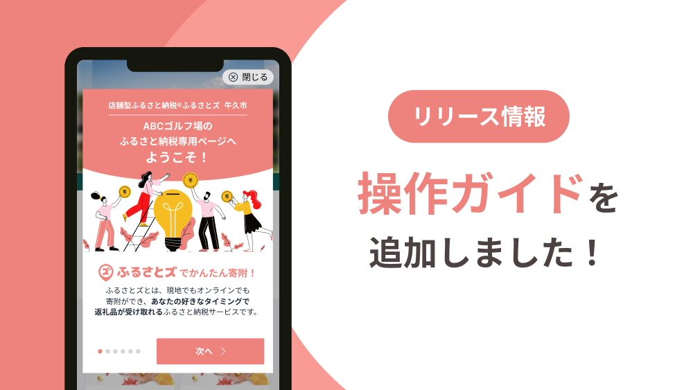
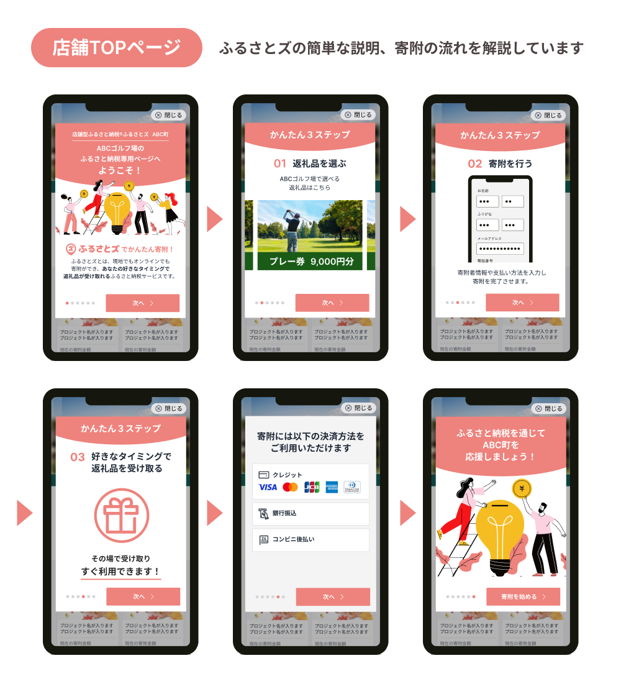
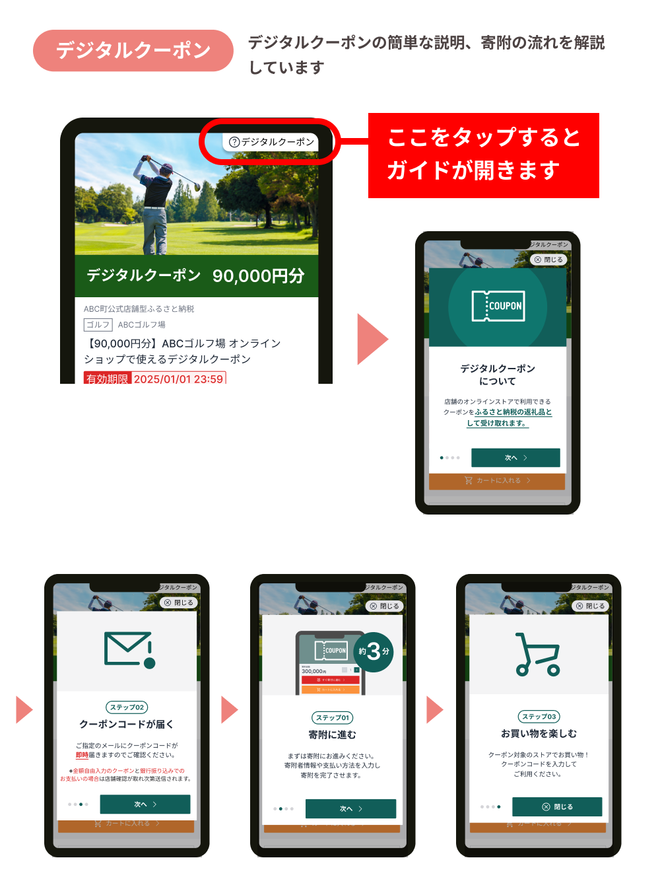
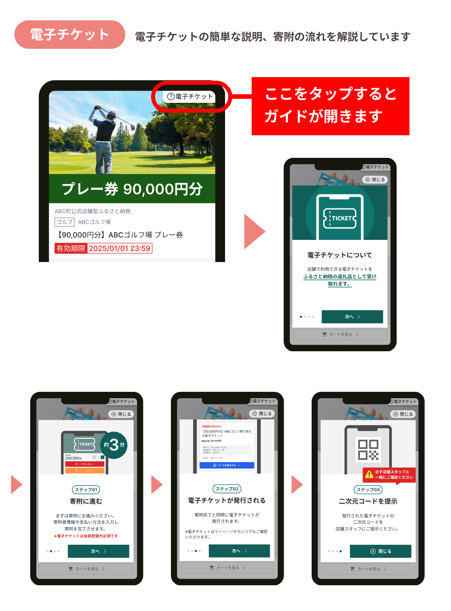

import { LinkCard, CardGrid } from '@astrojs/starlight/components';

### 申し込みページに操作ガイドが追加されました  

日頃より【ふるさとズ】をご愛用いただきまして、誠にありがとうございます。  
「店舗型ふるさと納税（R)『ふるさとズ』」運営事務局でございます。  

この度、寄附者さまがより快適にスムーズにお申し込みいただけるよう、店舗ページや返礼品ページに操作ガイドを追加いたしました。  

今までは店舗さまに設置いただいている販促物や店頭にいるスタッフの皆さまにご協力いただいて、操作のご案内をいただくことが多かったかと存じます。  

少しでもその負担を軽減し、ガイドを見るだけで寄附者さまが簡単にお申し込みできるような状態を目指しております。  
負担軽減はもちろんですが、利用いただく寄附者さまの利便性向上、寄附獲得に繋がれば幸いです。  

ご不明な点等ございましたらお申し付けください。  
ご理解・ご協力のほどよろしくお願い申し上げます。    

店舗型ふるさと納税（R)『ふるさとズ』運営事務局  
電話番号：050-5444-4054  
メールアドレス：contact@furusatos.com  
営業時間：8時30分～17時30分  
