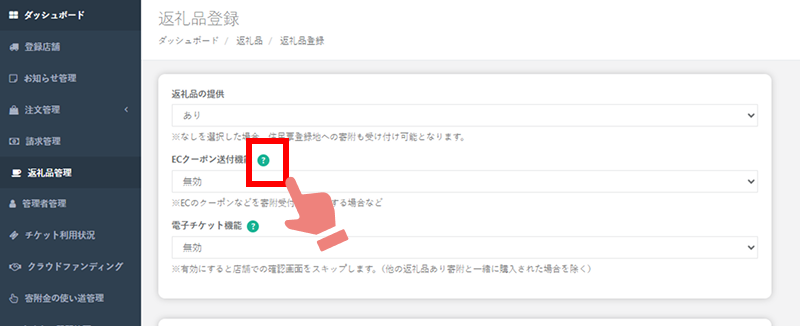
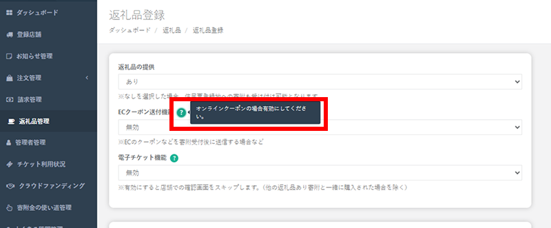

import { LinkCard, CardGrid } from '@astrojs/starlight/components';

### ふるさとズ管理画面にツールチップを追加しました  

日頃より【ふるさとズ】をご愛用いただきまして、誠にありがとうございます。  
「店舗型ふるさと納税（R)『ふるさとズ』」運営事務局でございます。  

ふるさとズの管理画面、注文情報の確認や返礼品の登録作業など、ご利用いただく際にもっとスムーズにお使いいただけるよう、このたび「ツールチップ」を追加いたしました！  

:::tip[ツールチップとは]
アイコンなどにマウスカーソルやポインターを重ね合わせた際に、一時的に表示される「ヒント」や「補足説明」のことです。 
:::  

登録時の「ここはどう入力したらいいの？」「これって何のこと？」など、ちょっとした疑問の解決にお役立ていただければ幸いです。  

---

1.クエスチョンマークにマウスカーソルやポインターを当てる

*自治体さま管理画面：返礼品管理*

2.右横に四角の吹き出しが表示されて補足説明が確認できます

*自治体さま管理画面：返礼品管理*

ご不明な点等ございましたらお申し付けください。  
ご理解・ご協力のほどよろしくお願い申し上げます。    

店舗型ふるさと納税（R)『ふるさとズ』運営事務局  
電話番号：050-5444-4054  
メールアドレス：contact@furusatos.com  
営業時間：8時30分～17時30分  
