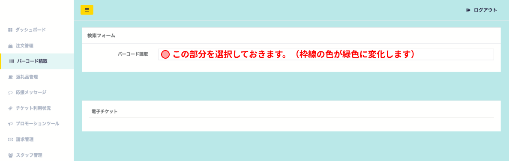
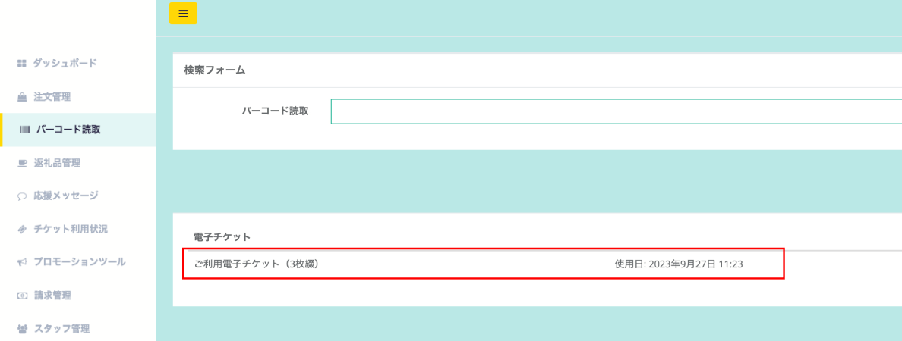

バーコード読み取りでは、電子チケットのコードを読み取ることが可能です。  
PCの管理画面から操作を行う場合は、事前にバーコードリーダーとPCを接続しておきます。

:::note[動作検証済みバーコードリーダー]

- [NEWLAND NS-FR27](https://www.newlandaidc.com/jp/products/Desktop-Scanner/FR27.html)
- [ELECOM XF1M11AMD](https://www.elecom.co.jp/products/XF1M11AMD.html)
- [ビジコム BC-NL3000U2](https://www.busicom.co.jp/h/bc-reader/bc-nl3000u.html)
:::

## バーコードの読み取り準備

*バーコード読取画面*

バーコードは読み取る前に、検索フォームの **バーコード読取** 欄を選択し、読み取りの準備を行ってください。  
選択ができていると、 **バーコード読取欄の枠線が緑色に変化** します。

その後、寄附者のバーコード（スマホまたは紙）をバーコードリーダーで読み取りましょう。

## バーコードの読み取り完了

*バーコード読取完了時*

読み取りができると、赤枠内のように表示がされます。  
以上で、電子チケットの確認作業は終了です。
