店舗さまの管理画面にオーナーアカウントでログインしていただくと、請求管理機能がご利用できます。  
請求書の作成、過去作成した請求書の一覧表示、年月ごとの寄附情報が表示できます。  

## 請求書の作成方法

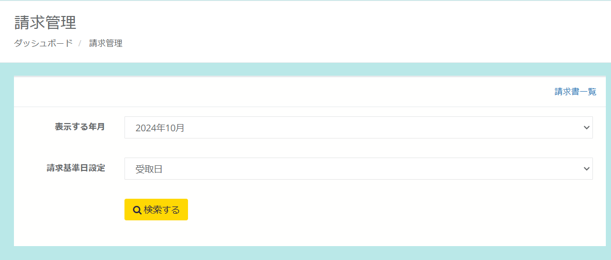
*請求管理画面*

### 1.　「表示する年月」「請求基準日設定」を選択  
・表示する年月  
・請求基準日設定「受取日」「寄附日」から選択

:::tip[請求書に計上する基準を「受取日」「寄附日」から選択が可能となりました]
・「受取日」返礼品を寄附者にお渡しし、受取済みの処理を実施した日  
・「寄附日」寄附者がお申し込みをして入金を完了した日  
:::

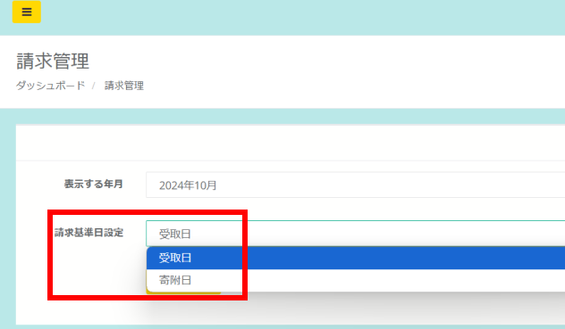
*請求基準日設定*

「検索する」を押すと、その下に対象の寄附が一覧で表示されます  

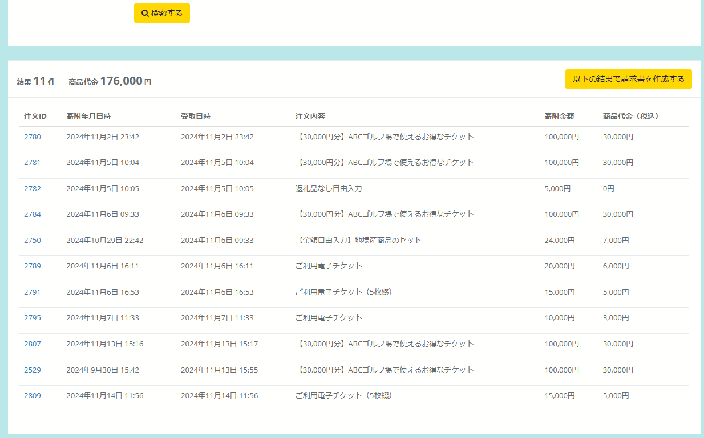
*請求対象寄附一覧*

### 2.　請求書を作成する  

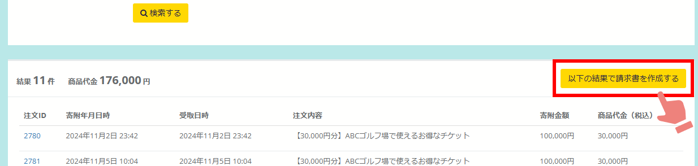
*請求対象寄附一覧*

「以下の結果で請求書を作成する」を押すと、請求書作成画面が表示されます。  
表示されている項目を確認し、必要に応じてご入力ください。  
※初回ご入力いただくと、次回以降は前回ご入力いただいた情報で表示されます。  

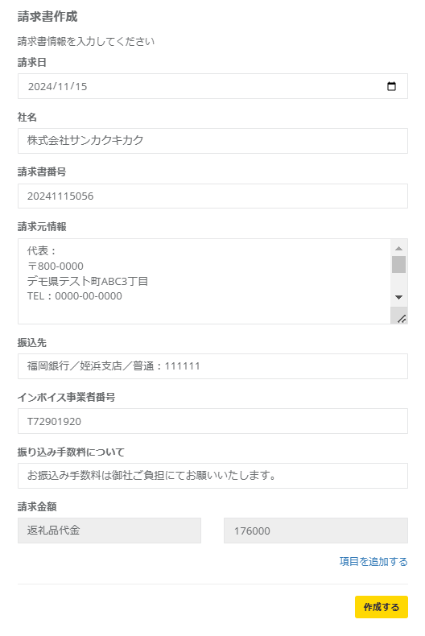
*請求書作成画面*

**請求書作成項目  
・請求日：請求日を入力（またはカレンダーから選択）  
・社名：店舗名（企業名）を記入  
・請求番号：任意で設定することが可能  
・請求元情報：店舗名（企業名）情報を記入  
・振込先：指定の口座情報を記入  
・インボイス事業者番号：インボイス事業者番号を記入  
・振込み手数料について：任意でテキストを入力  
・請求金額：自動的に金額が設定（編集不可）**   

請求金額は任意の項目を追加することも可能です。  
「項目を追加する」を押すとボックスが出現します。  
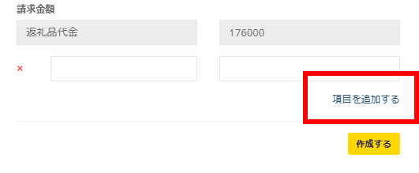
*請求書作成画面*

最後に「作成する」を押すと請求書が作成され、請求書一覧画面が表示されます。

### 3.　請求書のダウンロード・印刷  

請求書一覧より「請求書」を押すと請求書が表示されます。  
必要に応じて、印刷またはPDFで保存してご利用ください。    
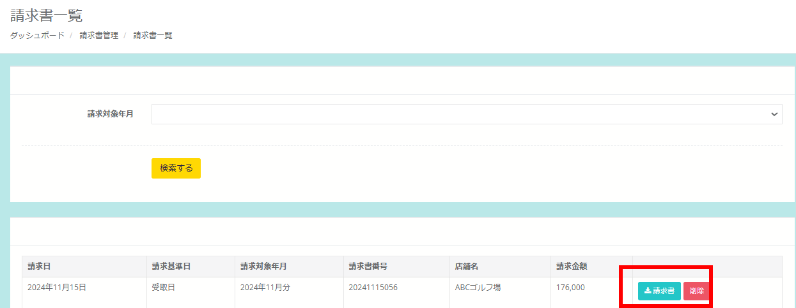
*請求書の表示*

**[請求書サンプル（PDF）](../../../pdf/seikyuusyo.pdf)**　

## 請求書一覧の表示

過去、作成した請求書を確認することが可能です。  

請求管理の画面右上にある「請求書一覧」をクリックします。

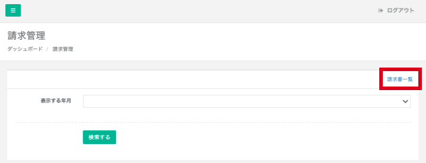  
*請求管理画面*

表示したい年月を選択し「検索する」を押すと、表示件数を絞ることが可能です。

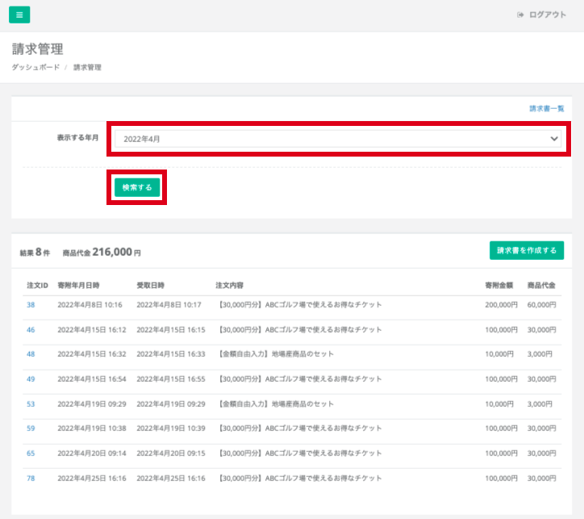
*請求書一覧の表示*

過去分の請求書も「請求書」を押すと表示することが可能です。  

*請求書の表示*

誤って請求書を作成した時など、過去に作成した請求書を削除することが可能です。  

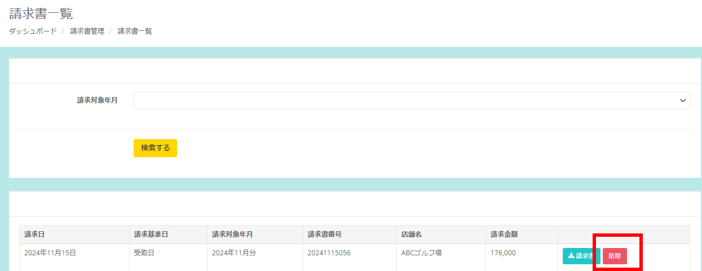
*請求書削除*

## 年月ごとの寄附情報一覧表示

請求管理画面では、請求書対象の寄附情報を一覧で確認することが可能です。  

*請求管理画面*

寄附情報一覧を確認したい年月を「表示する年月」で選択し、「請求基準日」を選択します。  
「検索する」を押すと、その下に対象の寄附が一覧で表示されます。  
※該当する寄附がない年月は、「表示する年月」に選択項目として表示されません。  

*請求対象寄附一覧*

詳細を確認したい寄附は、「注文ID」を押すと詳細画面が表示されます。  

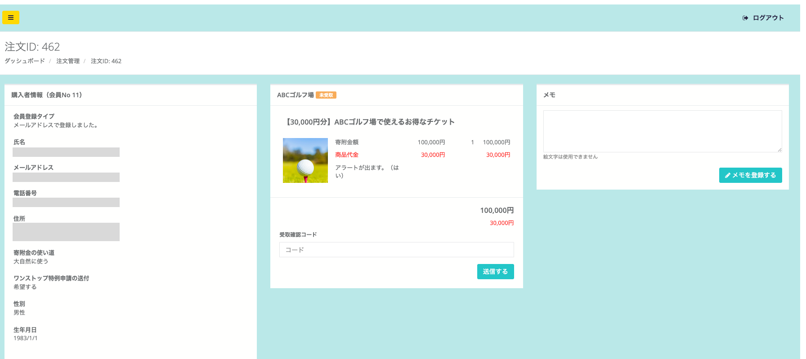
*注文詳細画面*

