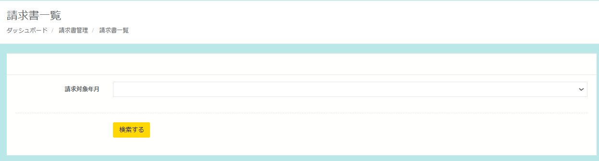

請求書一覧の表示、各店舗の年月ごとの寄附情報表示ができます。

## 年月ごとの寄附情報一覧表示

請求管理画面では、注文情報の一覧および請求書の一覧を確認できます。

  
*請求管理画面*

  
*年月ごとの注文一覧表示*

注文一覧を表示させるには表示させたい「年月」を選択し、「検索する」ボタンをクリックします。  
該当する注文がある場合、画面に一覧が表示されます。

  
*注文詳細画面*

各注文の詳細を確認するには、各注文の「注文ID」リンクをクリックします。

## 請求書の作成

表示する年月を選択し、寄附の一覧が表示されると請求書の作成ボタンが表示されます。

  
*月ごとの寄附一覧表示*

  
*請求書作成画面*

「請求書を作成する」を押すと、請求書作成画面が表示されます。  
表示されている項目を確認し、必要に応じて編集いただけます。

**・請求日：ご請求の日にちを選択**

**・社名：店舗名（企業名）を記入**

**・請求番号：任意で設定**

**・請求元情報：店舗（企業）情報を記入**

**・振込先：店舗（企業）振込先を記入**

また、請求金額は任意の項目を追加することも可能です。  
確認および編集の完了後、「作成する」ボタンを押すことで請求書を作成できます。

作成した請求書は、請求書一覧から確認ができます。（次項の「請求書一覧の表示」をご確認ください）

## 請求書一覧の表示

請求管理の画面右上にある「請求書一覧」をクリックします。

  
*請求管理画面*

表示したい年月を選択すると、表示件数を絞ることが可能です。

  
*請求書一覧の表示*

## 請求書PDFの表示

請求書PDFの表示は、請求書一覧に表示される請求対象年月の「PDF」のボタンをクリックします。

  
*請求書一覧の表示*

注文ごとの請求書がPDFで表示されます。必要に応じて印刷・保存いただけます。

  
*請求書の表示*