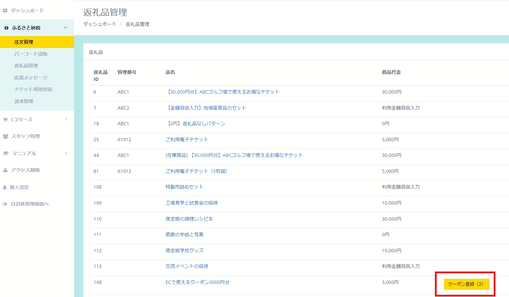
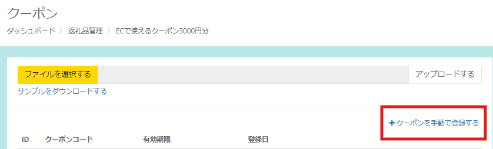
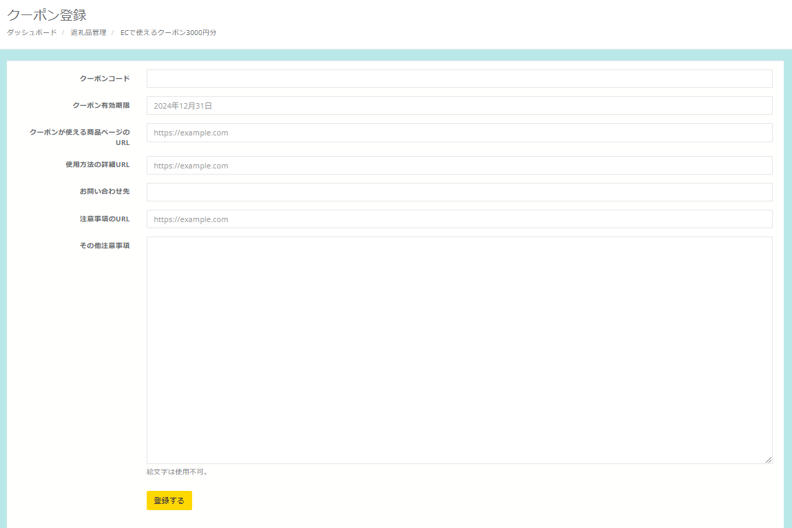
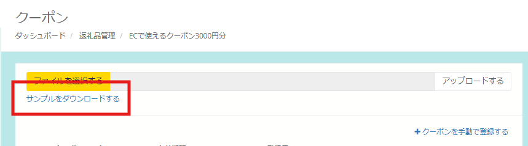
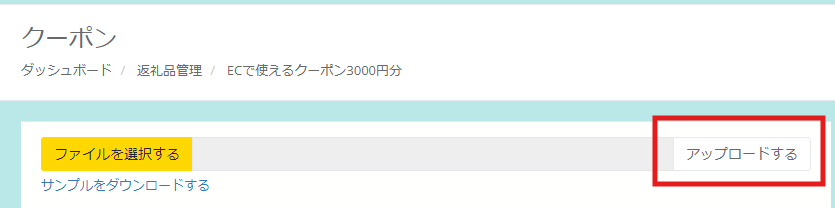

ふるさとズでは、返礼品としてオンラインクーポンの設定も可能です。  
オンラインとオフラインの両方を有効活用することで、寄附の選択肢を広げ、利用者の満足度アップにつなげることができます。  

:::note[オンラインクーポンに関する資料]
[寄附準備事項（PDF）](../../../pdf/online-coupon_settings.pdf)　　[寄附フロー図（PDF）](../../../pdf/online-coupon_flow.pdf) 
:::

### オンラインクーポン利用時の流れ
オンラインクーポン利用時の全体の流れは下図に示す通りです。  
寄附が入った後に店舗（事業者）側では、**クーポン発行の処理が必要になります（下図赤枠部分）**。  

*オンラインクーポン利用時の流れ*

### オンラインクーポン クーポンコード事前登録手順
オンラインクーポンの返礼品を登録後、返礼品毎に事前にクーポンコードを登録していただく必要があります。  

クーポンコードの登録は **「店舗（事業者）側の管理画面」** の返礼品管理画面にて行います。  

1. 返礼品管理画面にて、登録したい返礼品の「クーポン登録」をクリックします。

*返礼品管理画面*  
*オンラインクーポンにはクーポン登録ボタンが表示されます）*   

2. クーポン画面より手動もしくは一括での登録が可能です。  

●手動登録の場合  
「＋クーポンを手動で登録する」をクリックする  

*クーポン画面*

各項目に応じて入力し、最後に登録ボタンをする  

*クーポン画面*

●一括登録の場合  
サンプルをダウンロードする   

*クーポン画面*

ダウンロードしたデータにクーポンコードを入力する  

作成したデータをアップロードする  

3. メール件名、本文を入力します。  
※定型文の登録が可能ですので、ぜひご利用ください。

*注文詳細画面*

##### 定型文の作成
発行通知のメールは定型文を設定可能です。  
設定するには、「定型文を登録する」をクリックします。  

*定型文の登録*

登録画面が表示されますので、定型文とする件名と本文を入力し、「更新する」をクリックします。

*定型文の登録画面*

##### 定型文の反映
登録した定型文は「定型文を貼り付ける」をクリックすることで利用が可能です。  
**個別で書き換える箇所がある場合は、書き換え漏れが無いかをよく確認した上で、「メール送信」ボタンをクリックしてください。**

*定型文の利用*

