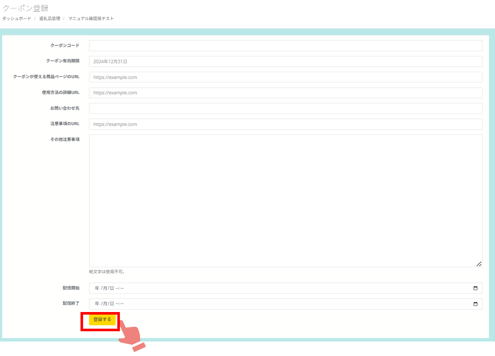

ふるさとズでは、返礼品として店舗さまがお持ちのECサイトで利用できるオンラインクーポンの設定が可能です。  
※出品したい店舗さまでお持ちのECサイトがクーポン発行できるかわからない場合はふるさとズ運営事務局までご連絡ください。  

:::note[オンラインクーポンに関する資料]
[寄附準備事項（PDF）](../../../pdf/online-coupon_settings.pdf)　　[寄附フロー図（PDF）](../../../pdf/online-coupon_flow_v2.pdf) 
:::

## オンラインクーポン寄附の流れ
オンラインクーポン寄附の全体の流れは下図に示す通りです。  
予めECサイトで発行済みのクーポンを登録しておくことで、寄附が入った際に自動でクーポンコードの送付が可能です。    

*オンラインクーポン寄附の流れ*

&nbsp;
&nbsp;

## オンラインクーポンをご利用前の準備

オンラインクーポンをご利用いただくにあたり、自社ECサイト（システム）・予約システムで事前に準備いただきたい内容がございます。  

### 1. クーポン使用の注意書き  

ECサイト内にクーポンコード使用についての注意書きを掲載（記事等）お願いします。  
雛形のバナーをご用意しておりますので、ご希望の方は運営事務局までお申し付けください。  

:::note[ノート]
寄附者さまへ案内するクーポンコードを記載したメールの中に注意事項として、作成したページのURLを登録することが可能です  
:::

### 2. クーポン返礼品への誘導バナー設置  

ECサイト内にふるさとズ店舗ページや商品ページへ遷移できるリンクバナー等を設置ください。  
（例：https://furusatos.com/自治体名/店舗番号 ）    

*誘導バナー例*  

### 3. 対象商品へタグ・カテゴリーなどを設置  

寄附者さまで「ふるさと納税」対象商品の判別がつきやすいよう対象商品の説明文に記載いただくか、タグ・カテゴリーなどを作成し設置していただくのをお勧めしております。  
各種システムにじて可能な限り対応をお願いします。  

*カテゴリー分け例*  

### 4. クーポンコード発行  

自社ECシステム、予約システムでクーポンコードやコードリンクの事前発行をお願いします。

:::caution 
・有効期限の設定をお願いします。  
・利用制限は1コード／1回のみ、1寄附につき1コード発行となります。  
・ふるさとズシステムへはCSVで一括 または 個別アップロードが可能です。  
・事前に一定数のコードを発行、登録しておくとスムーズです。  
:::

&nbsp;

## オンラインクーポンの事前登録
寄附受付時にオンラインクーポンを寄附者へ自動発行するには、返礼品毎に事前にクーポンコードを登録していただく必要があります。  

クーポンコードの登録は **「店舗（事業者）側の管理画面」** の返礼品管理画面にて行います。  

:::note[ノート]
事前に自社ECシステム、予約システムで発行いただいたクーポンコードが必要になります。  
:::

### 1. クーポン管理画面を開く  
返礼品管理画面にて、登録したい返礼品の「クーポン登録」をクリックし、クーポン管理画面を開きます。（）内の数字は残りのクーポンコード数です。

*返礼品管理画面 ※オンラインクーポンにはクーポン登録ボタンが表示されます*

### 2. クーポンコードを登録する
クーポンコードは一括登録と手動登録の両方が可能です。  
ここで登録した内容が、寄附受付時に寄附者へ自動送信されるメールに記載されます。

*自動送信メール例*

#### ●手動登録の場合 
「＋クーポンを手動で登録する」をクリックします。  

各項目に沿って入力し、最後に登録ボタンをクリックします。
:::note[各項目について]
**クーポンコード（必須）**：ECサイト側で発行したクーポンコードをそのまま入力してください。  
**クーポン有効期限**：ECサイト側で発行したクーポンの有効期限をそのまま入力してください。  
**クーポンが使える商品ページのURL**：クーポンが使える商品ページのURLを登録します。  
**使用方法の詳細URL（必須）**：ECサイト側でクーポンのご利用方法や、そのURLを登録します。  
**お問い合わせ（必須）**：  店舗のお問い合わせ先を入力してください。  
**注意事項のURL**：事前準備で作成いただいたECサイトの利用にあたっての注意事項が記載されたページのURLを登録します。  
**その他の注意事項**：  本クーポンに関する注意事項があれば、入力してください。  
:::

#### ●一括登録の場合  
最初にサンプルデータをダウンロードします。

ダウンロードしたデータをExcelで開き、必要情報を入力し保存します。

クーポン管理画面の「ファイルを選択する」から先ほど保存したCSVファイルを選択し、「アップロードする」ボタンをクリックします。

意図した通りに登録できているかを確認し、個別の記載事項がある場合は「編集」ボタンから詳細の記入をしてください。

以上で登録作業は完了です。