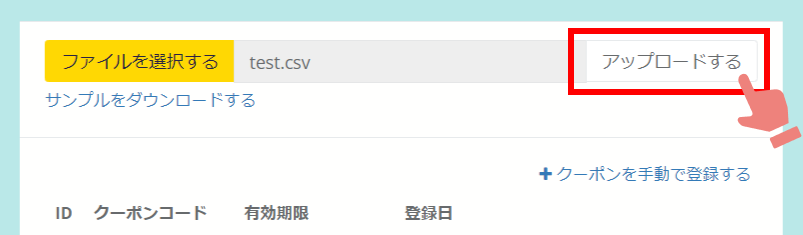

ふるさとズでは、返礼品としてオンラインクーポンの設定も可能です。  
店舗がお持ちのECサイトで発行したクーポンの一括登録・自動送付ができます。  

:::note[オンラインクーポンに関する資料]
[寄附準備事項（PDF）](../../../pdf/online-coupon_settings.pdf)　　[寄附フロー図（PDF）](../../../pdf/online-coupon_flow_v2.pdf) 
:::

## オンラインクーポン寄附の流れ
オンラインクーポン寄附の全体の流れは下図に示す通りです。  
予めECサイトで発行済みのクーポンを登録しておくことで、寄附が入った際に自動でクーポンコードの送付が可能です。    

*オンラインクーポン寄附の流れ*

&nbsp;
&nbsp;
&nbsp;

## オンラインクーポンの事前登録
寄附受付時にオンラインクーポンを寄附者へ自動発行するには、返礼品毎に事前にクーポンコードを登録していただく必要があります。  

クーポンコードの登録は **「店舗（事業者）側の管理画面」** の返礼品管理画面にて行います。  

### 1. クーポン管理画面を開く
返礼品管理画面にて、登録したい返礼品の「クーポン登録」をクリックし、クーポン管理画面を開きます。

*返礼品管理画面 ※オンラインクーポンにはクーポン登録ボタンが表示されます*

### 2. クーポンコードを登録する
クーポンコードは一括登録と手動登録の両方が可能です。  
ここで登録した内容が、寄附受付時に寄附者へ自動送信されるメールに記載されます。

*自動送信メール例*

#### ●手動登録の場合 
「＋クーポンを手動で登録する」をクリックします。  

各項目に沿って入力し、最後に登録ボタンをクリックします。
:::note[各項目について]
**クーポンコード（必須）**：ECサイト側で発行したクーポンコードをそのまま入力してください。  
**クーポン有効期限**：ECサイト側で発行したクーポンの有効期限をそのまま入力してください。  
**クーポンが使える商品ページのURL**：クーポンが使える商品ページのURLを登録します。  
**使用方法の詳細URL（必須）**：ECサイト側でクーポンのご利用方法をご準備いただき、そのURLを登録します。  
**お問い合わせ（必須）**：  店舗のお問い合わせ先を入力してください。  
**注意事項のURL**：  ECサイトの利用にあたっての注意事項をご用意いただき、そのURLを登録します。  
**その他の注意事項**：  本クーポンに関する注意事項があれば、入力してください。  
:::

#### ●一括登録の場合  
最初にサンプルデータをダウンロードします。

ダウンロードしたデータをExcelで開き、必要情報を入力し保存します。

クーポン管理画面の「ファイルを選択する」から先ほど保存したCSVファイルを選択し、「アップロードする」ボタンをクリックします。

意図した通りに登録できているかを確認し、個別の記載事項がある場合は「編集」ボタンから詳細の記入をしてください。

以上で登録作業は完了です。