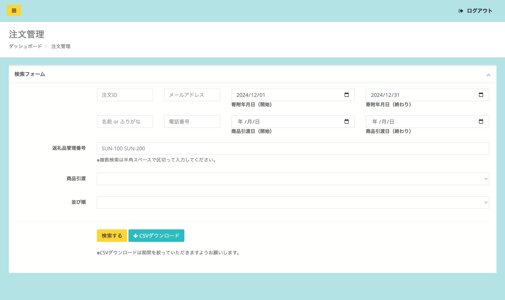
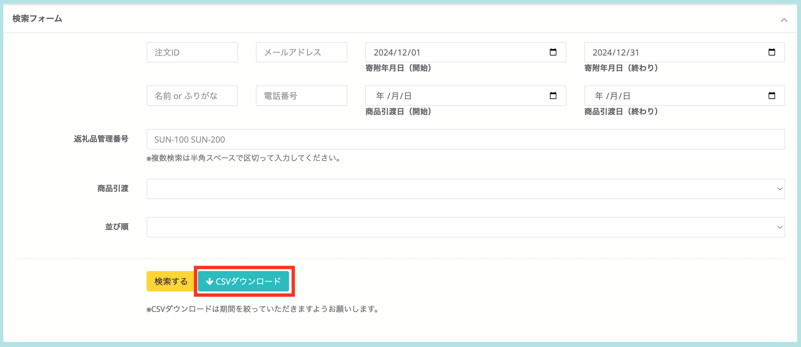
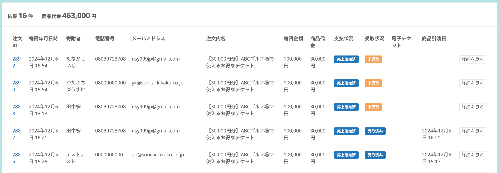
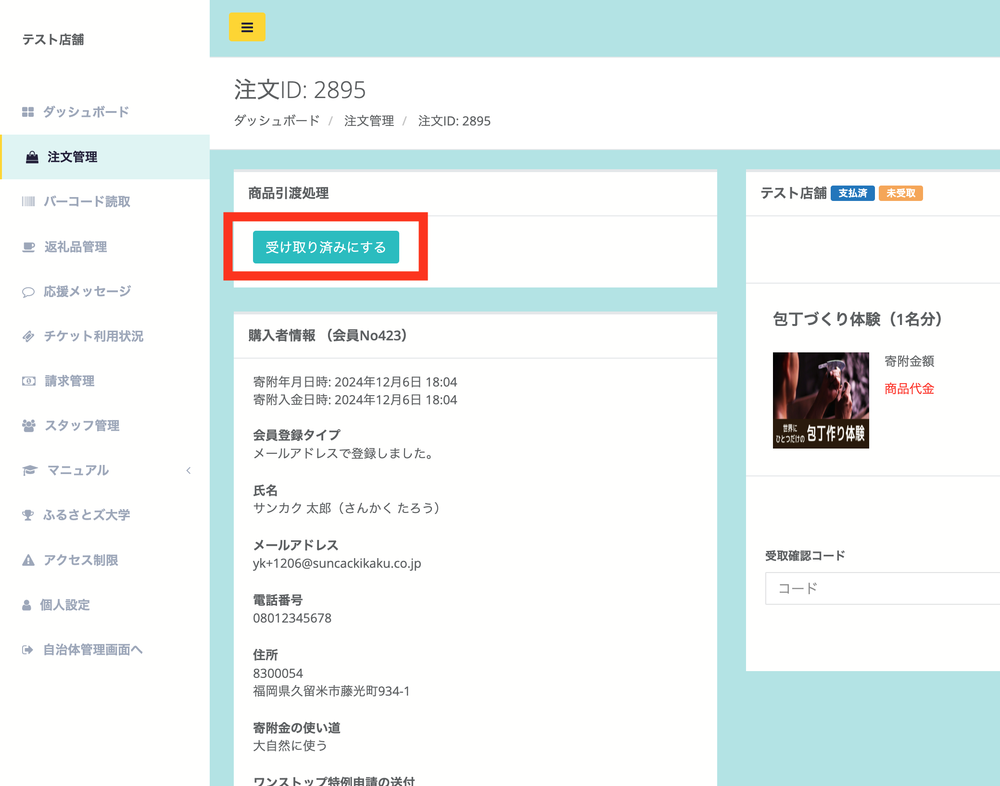
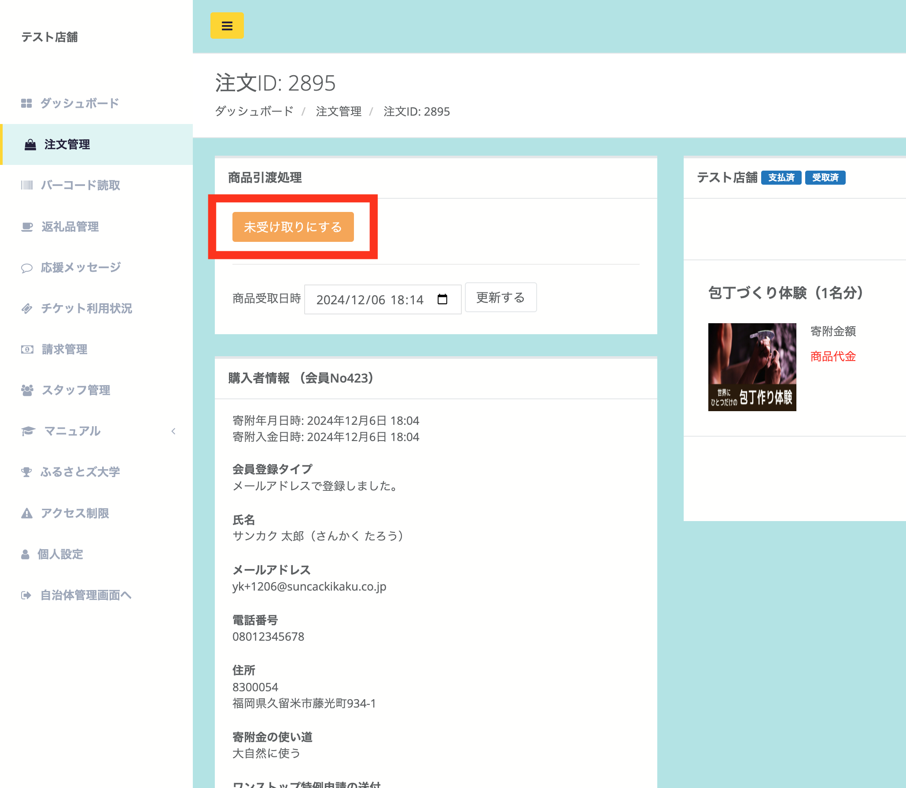
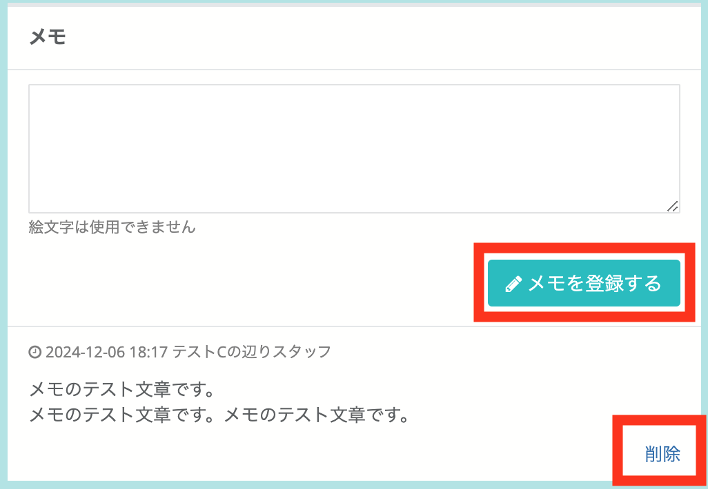

注文管理では、注文情報の一覧表示、検索、CSV出力、各注文のステータス編集やメモの登録が可能です。　

## 寄附情報の検索
注文情報の一覧表示、CSV出力が可能です。  
メニューの「注文管理」から注文管理画面を開きます。

*「注文管理」画面*

検索フォームでは、下記の項目で注文情報の検索が可能です。

- 注文ID
- メールアドレス
- 名前 or ふりがな
- 電話番号
- 寄附年月日
- 商品引渡日
- 商品引渡ステータス（未受け取り・引き渡し済）
- 並び順（昇順・降順指定）

## CSV出力

*検索フォーム*

検索した結果はCSVでの出力が可能です。  
検索フォーム内にある **「CSVダウンロード」** のボタンをクリックするとCSVにて出力されます。

## 注文詳細

検索フォームの下には、注文一覧が表示されます。

*注文一覧*

詳細を確認したい注文の「詳細を見る」ボタンをクリックすると、詳細画面が確認できます。

*注文詳細画面（支払済・受け渡し前の場合）*

*注文詳細画面（支払済・受け渡し後の場合）*

注文詳細画面では、購入者情報・購入した商品の支払いステータス・メモが確認できます。  

## 商品引渡処理

オーナーアカウントに限り、店舗管理画面にて商品引渡処理のステータス変更が可能です。  

商品を渡した場合は、「受け取り済みにする」を押してください。  

  
*商品引渡処理（支払済・受け渡し前の場合）*  

誤って処理してしまったなど、商品を渡す前に戻したい場合は、「未受取りにする」を押してください。 

  
*商品引渡処理（支払済・受け渡し後の場合）*  

## メモ登録

注文詳細画面から個別のメモを登録することができます。  
※メモの内容の確認および登録は自治体と店舗双方でできます。

*注文詳細画面*

*メモ登録後の画面*

メモしておきたい内容を入力し、 **「メモを登録する」** ボタンをクリックします。  
登録すると、入力画面下に内容が残ります。  
削除したい場合は右下の **「削除」** リンクで対応が可能です。