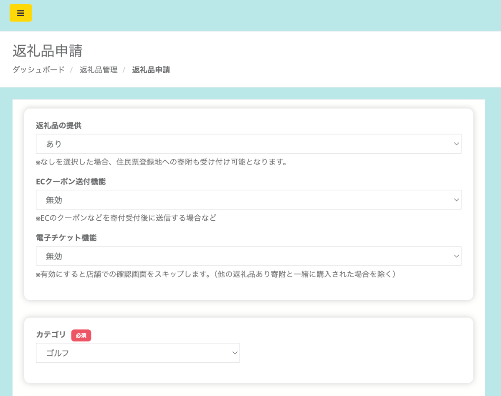
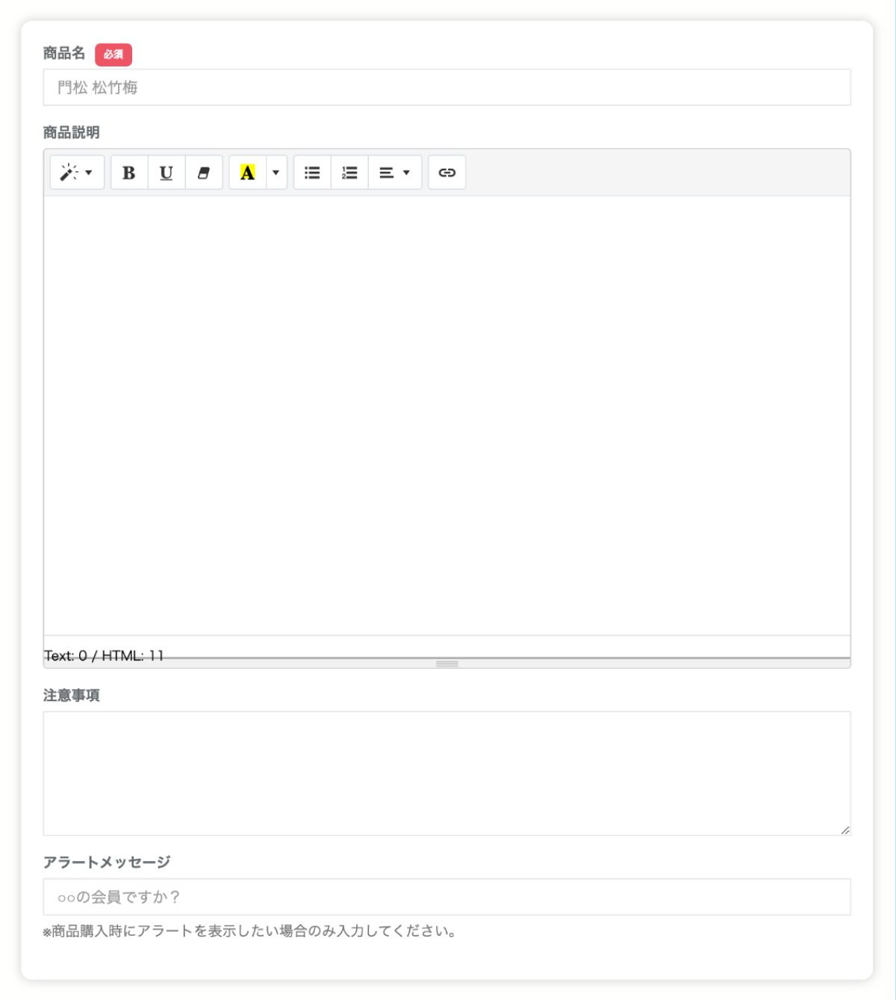
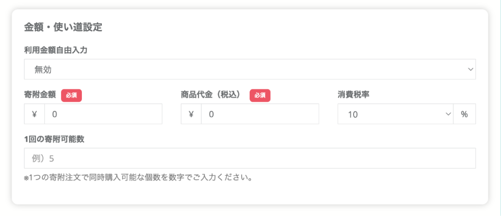
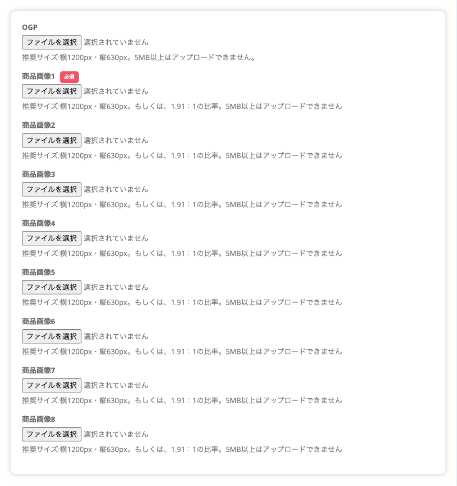
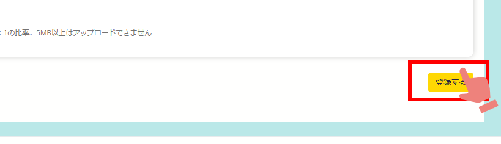
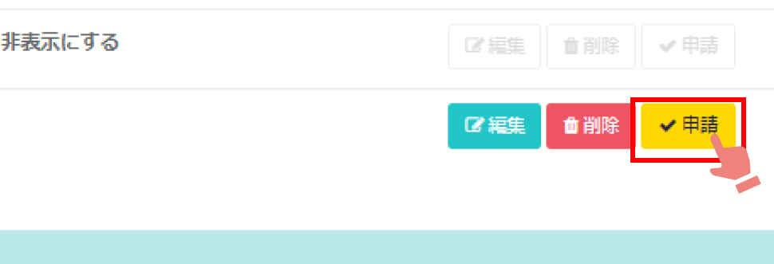
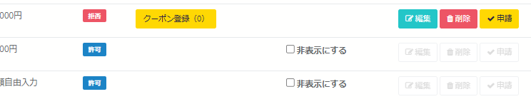

返礼品の表示・非表示を店舗さまで変更することができます。

## 返礼品の表示設定

*返礼品管理画面*

店舗さまのご都合で返礼品の寄附注文の受付ができない場合、管理画面から設定が可能です。  
非表示にしたい返礼品の **「非表示にする」** にチェックを入れると、寄附者さま画面への非表示設定ができます。

チェックをはずすことで、再度表示することが可能です。

## 返礼品申請機能  

店舗さまで新たに出品したい返礼品がありましたら管理画面から申請することができます。

:::caution
店舗さまで申請後、自治体さまの管理画面に通知が届く仕様になっております。  
初めて本機能を使用される場合は申請後、自治体さまにご連絡いただくことをお勧めします。  
その後、両者間でスムーズに連携が取れるよう自治体さまとご相談のうえ、本機能をご活用ください。  
:::

返礼品申請方法は店舗さまの管理画面にログインの上、下記の手順をご覧ください。

1.　返礼品管理画面「返礼品申請」ボタンをクリックします。

*返礼品管理画面*  

2.　返礼品申請画面が表示されますので各項目に沿ってご入力ください。  

*返礼品申請画面1*  

- **返礼品の提供（あり／なし）**  
返礼品の提供有無を選択します。初期設定は「あり」となっています。  
返礼品なしの寄附ページの登録は、**返礼品の提供「なし」を選択** します。  
「なし」を選択すると、住民票登録地への寄附（お住まいの地域への寄附）も受け付けが可能となります。

- **ECクーポン送付機能（無効／有効）**  
オンラインクーポン返礼品を登録する際は必ず「有効」に設定してください。  
オンラインクーポン返礼品の登録（事前準備）は[オンラインクーポンの登録マニュアル](/shops/online-coupon/)をご確認ください。  

- **電子チケット機能（無効／有効）**  
利用券や回数券を電子チケットとして発行できる機能です。  
初期設定は「無効」となっています。  
「有効」を選択すると、店舗での確認画面をスキップします。  
※ただし、返礼品ありのものと同時に寄附がされた場合は除く。  

- **カテゴリ【必須】**  
初期設定で登録されたカテゴリから選択します。  
該当するカテゴリがない場合はシステム管理者（contact@furusatos.com）にお問い合わせください。  

*返礼品申請画面2*  

- **商品名【必須】**  
返礼品の名称を入力してください。  

- **商品説明**  
返礼品に関する説明文を入力してください。  

- **注意事項**  
ご利用に際して寄附者へ伝えたい注意事項を入力してください。  

- **アラートメッセージ**  
購入時にアラートメッセージを出したい場合は、メッセージを設定できます。  

*返礼品申請画面3*  

- **利用金額自由入力（無効／有効）**  
寄附金額を自由に入力することができる機能を設定します。  
初期設定は「無効」となっています。  

- **寄附金額【必須】**  
実際に寄附する金額を1,000円以上で設定します。  
※寄附金額がわからない場合は仮の値でご入力ください

- **商品代金（税込）【必須】**  
商品本体の代金を税込で設定します。

- **消費税率**  
商品にかかる税率を設定します。

- **1回の寄附可能数**  
利用者が同時に注文できる数を設定できます。

*返礼品申請画面4*  

- **OGP**  
SNSでシェアされた際に表示されるサムネイル画像を設定できます。

- **商品画像1〜8**  
商品画像を最大8枚まで設定できます。

:::danger[point]
必須項目以外（画像は未選択でも可）は未入力で申請することが可能です。  
:::  

3.　必要な項目の入力が終わりましたら、最後に右下の「登録」ボタンをクリックします。

*返礼品申請画面5*  

4.　返礼品管理画面に戻ると、登録した返礼品の右横に「申請」ボタンが表示されます。  
　　必ず「申請」ボタンのクリックをお忘れないようにお願いします。  

*返礼品管理画面*  

:::caution
「申請」ボタンをクリックすることで、自治体さまの管理画面に通知が届きます。  
途中まで入力して後ほど改めて申請したい場合は、「申請」ボタンをクリックしなければ、自治体さまに通知は届きません。
:::  

申請した返礼品が自治体さまで「棄却」された場合、返礼品一覧で状況が「拒否」と表示されます。
返礼品の内容を見直し編集して、再申請することが可能です。

*返礼品管理画面*  

