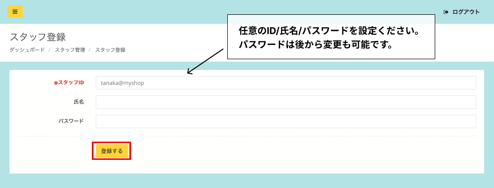
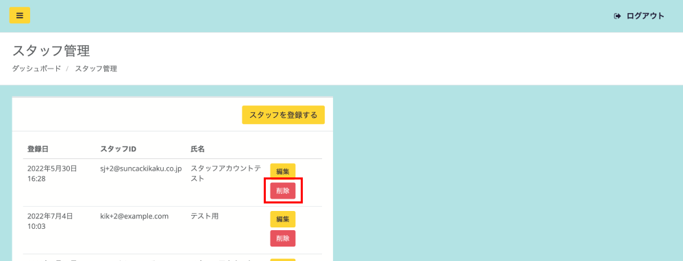

スタッフ管理では、店舗スタッフアカウントの登録・編集・削除が可能です。

:::caution[寄附確認の使い方]
寄附者様の店舗レジでの寄附確認の方法の手順をご紹介  
→ [**手順はこちら**](https://www.notion.so/7fa265187af94eebb338caefe0ba22c7?pvs=21)

**アカウントに関する注意事項**  
オーナー用とスタッフ用の2種類がございます。  
①スタッフ用では主に店舗での寄附確認対応のみが可能です。  
②オーナー用では、返礼品の非表示切り替えや、寄附者様の個人情報(氏名やご住所等)まで確認が可能です。  
※個人情報保護のため確認可能な範囲が異なります。  
①②いずれも、 **アプリとPCで** でご利用いただけます。
:::

## スタッフの登録

管理画面の操作を行うスタッフを登録、編集、削除できます。  
メニューの「スタッフ管理」からスタッフ管理画面を開きます。

*スタッフ管理画面*

*スタッフ登録画面*

右上の **「スタッフを登録する」** ボタンをクリックし、スタッフID（任意の文字列）・氏名・パスワードを登録し、 **「登録する」** ボタンをクリックします。

## スタッフの編集

*スタッフ管理画面*

管理画面から編集したいスタッフの **「編集」** ボタンをクリックします。

*編集画面*

該当箇所を編集し、 **「登録する」** ボタンをクリックすると編集が反映されます。

## スタッフの削除

*スタッフ管理画面*

管理画面から削除したいスタッフの **「削除」** ボタンをクリックします。  
「削除しますか？」という表示に **「OK」** のボタンをクリックすると反映されます。

:::note[複数自治体で出品されている店舗様へ]
アカウントのグループ設定をすることで、ひとつのアカウントで自治体を跨いで、複数店舗の管理･寄附状況が閲覧できるようになりました。  
運営事務局にてグループ設定が必要になりますので、ご希望の店舗様は事務局までご連絡ください。 
:::

