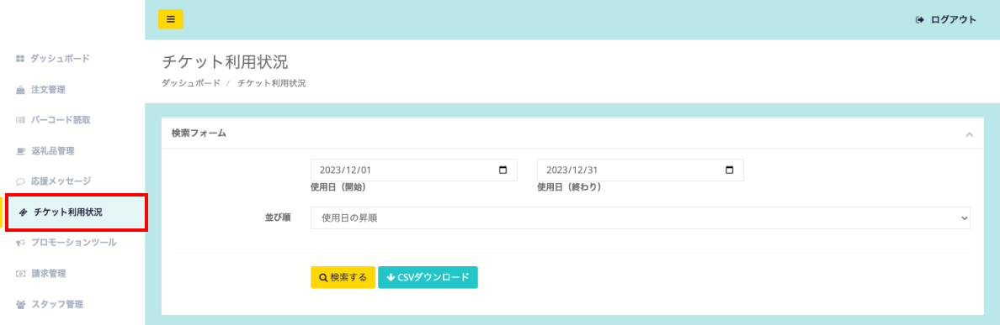
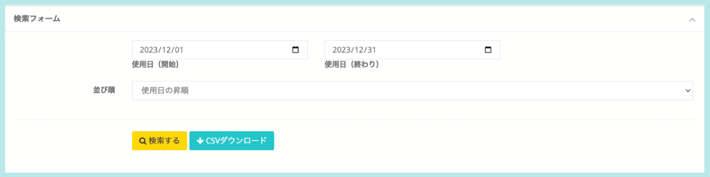
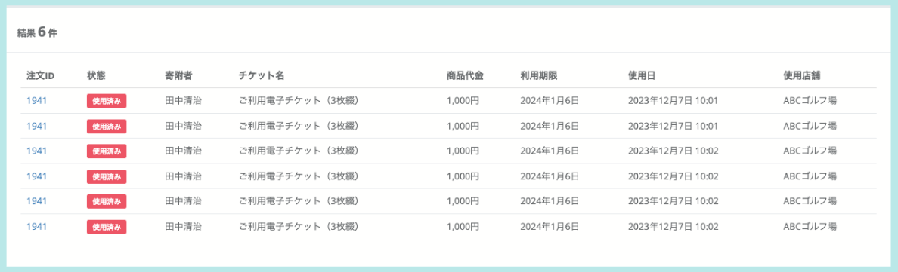

ふるさとズで発行した電子チケットの利用状況は、管理画面から一覧で確認することが可能です。

## 電子チケット一覧の表示
ふるさとズで発行した電子チケットの利用状況を確認してみましょう。

*発行した電子チケット一覧*

電子チケットの利用状況は管理画面の「チケット利用状況」から確認ができます。

### 電子チケットの検索

*発行した電子チケットの検索*

一覧画面上部の検索フォームから、発行した電子チケットの絞り込みが可能です。  
また、検索結果はCSV形式でダウンロードも可能です。

検索フォームに入力できる情報は以下です。
- **使用日（開始・終わり）**  
電子チケットの利用された期間を任意の日付で選択できます。

- **並び順（昇順・降順）**  
使用日の昇順・降順で並び替えが可能です。

### 電子チケットの利用状況

*表示される情報*

画面下部には利用状況の一覧が表示されます。  
表示される情報は下記です。
- **注文ID**  
注文IDが表示されています。  
クリックすることで、注文の詳細情報が確認できます。

- **状態**  
利用状況（未使用または使用済み）が表示されています。  

- **寄附者**  
寄附者名が表示されています。

- **発行店舗**  
発行店舗が表示されています。

- **チケット名**  
電子チケットの返礼品名が表示されています。

- **商品代金**  
商品代金が表示されています。

- **利用期限**  
電子チケットの利用期限日が表示されています。

- **使用日**  
電子チケットの使用日時が表示されています。

- **使用店舗**  
電子チケットの使用店舗が表示されています。

