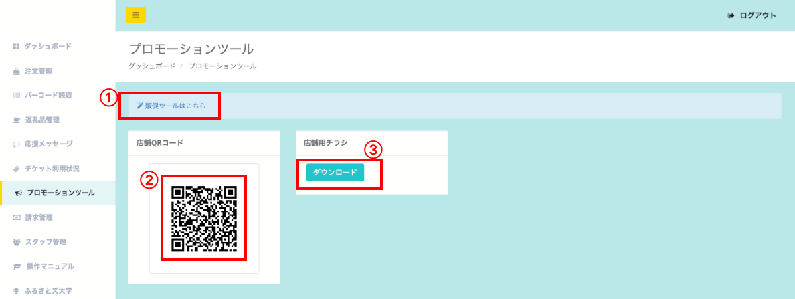

プロモーションツールでは、販促にお使いいただくデータや二次元コードを取得いただけます。

## プロモーションツール管理画面の見方

  
*プロモーションツール画面*

1. 販促ツールはこちら  
各種販促ツールのダウンロードページへ遷移します。  
無料でご利用いただけますので、ぜひご活用ください。

2. 店舗QRコード  
ふるさとズの店舗ページのQRコードです。  
画像として保存も可能です。  
※印刷用に最適化はされておりませんので、大きな印刷物へのご使用時は注意ください。画像が粗くなり、読み取れない可能性がございます。

3. 店舗用チラシ  
自治体側が設定した店舗用チラシをダウンロードすることができます。