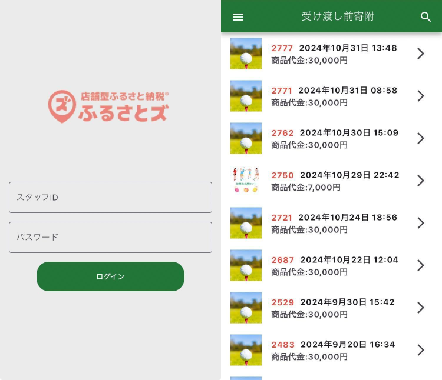
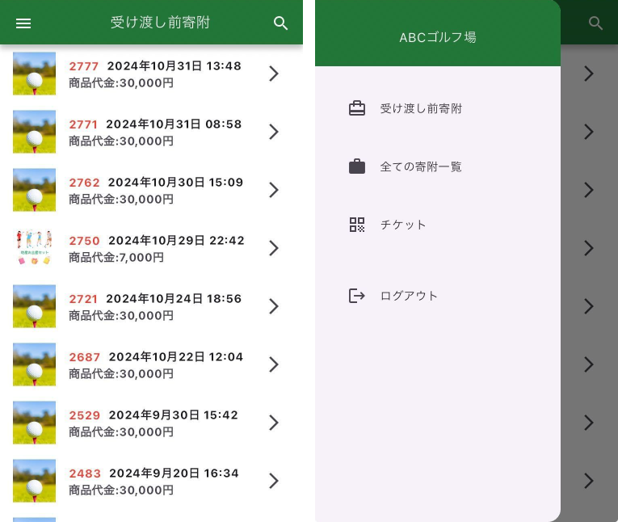
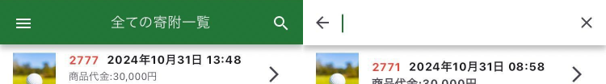
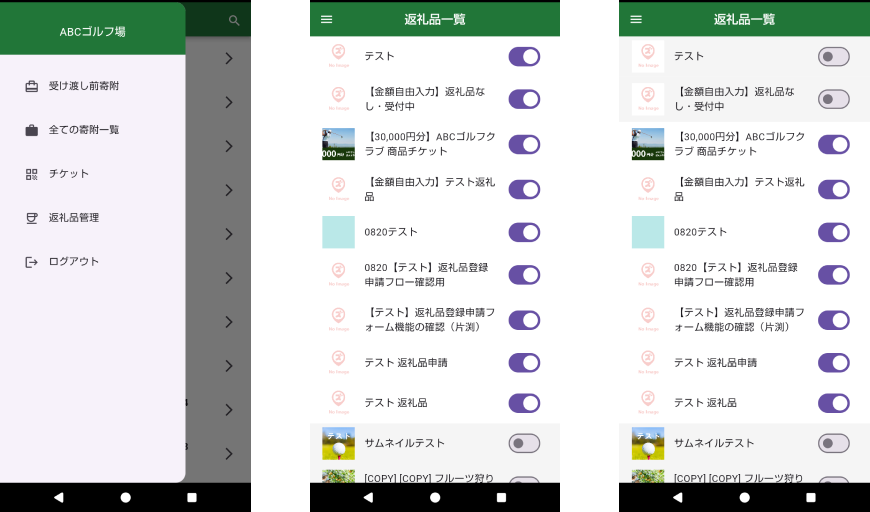
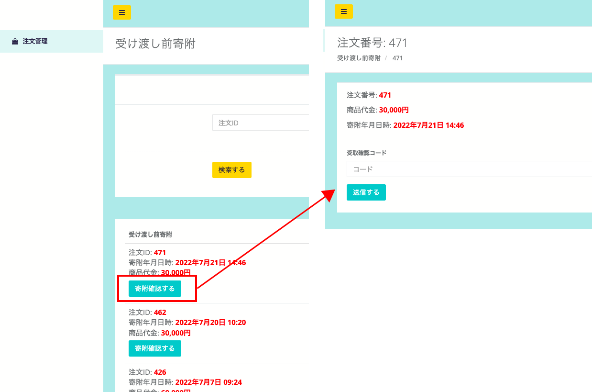
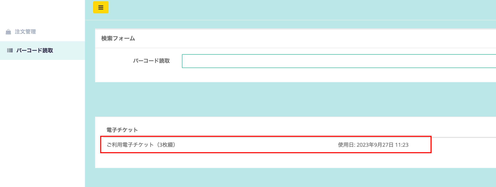

店舗スタッフの方には、専用アプリまたは管理画面での寄附確認作業をお願いしております。

## アプリの使い方

店舗スタッフの寄附確認用に専用アプリを配布しています。

:::note[店舗スタッフ専用アプリ]
Android用アプリ：[ダウンロードリンク](https://play.google.com/store/apps/details?id=com.suncackikaku.furusatos.store)  
iPhone用アプリ  ：[ダウンロードリンク](https://apps.apple.com/app/id1632550284)
:::

以降はAndroid端末での表示画面で説明しております。

### 1. ログイン

  
*店舗用ログイン画面（左）とログイン後画面（右）*

アプリを起動させると、ログイン画面が表示されます。  
店舗スタッフとして登録済みのメールアドレスとパスワードにてログインしてください。

ログイン後は「受け渡し前寄附」の画面が表示されます。

### 2. メニュー

*受け渡し前寄附画面（左）とメニュー表示画面（右）*

アプリのメニューは、画面左上のメニューボタン（3本線のアイコン）をタップすることで表示できます。

### 3. 受け渡し前寄附機能・全ての寄附一覧機能

*受け渡し前寄附画面（左）と全ての寄附一覧画面（右）*

受け渡し前寄附機能と全ての寄附一覧機能では、どちらも寄附一覧を表示しています。

2つの機能の違いは下記の通りです。  
**受け渡し前寄附**：商品の受け渡し（店舗確認）が終わっていない注文の一覧。  
**全ての寄附一覧**：全注文の一覧。店舗確認完了済みのものは緑色表示。

寄附一覧画面では、右上の検索アイコンから寄附の検索が可能です。（下図）

*検索機能*

### 4. 商品の受け渡し（受取引渡確認）

*お客様の商品注文画面（左）と店舗受け取り確認タップ後の画面（右）*

お客様が商品を受け取る際は、お客様の画面上で店舗受け取り確認ボタンを押してもらいます。  
ボタンを押すと、確認コード・注文番号・寄附日が表示されます。

*受け渡し前寄附画面（左）・受け取り確認画面（中央）・受け取り完了後画面（右）*

お客様の画面に表示されている注文番号と寄附日と一致する注文を受け渡し前寄附画面から選択します。  
注文詳細画面では確認コードが入力できるようになっており、お客様の画面に表示されている確認コードを空欄に入力し、店舗受け取り確認ボタンを押します。

システム上で一致を確認できると、寄附詳細に受取済みと表示がされますので、お客様に商品をお渡しください。

**寄附者さまへの受取確認画面のご案内方法（2パターン）**  
寄附者さまが店舗に来られた際に寄附受取画面へは、下記いずれかの方法をご案内ください。

*寄附者さまマイページ画面（マイページQRコード）*

1. **マイページでの確認**  
[マイページ](https://furusatos.com/mypage/)の注文履歴から該当商品の「店舗受け取り確認」ボタンをタップし、  
店舗受取画面へとご案内ください。

*寄附申込確認メール（イメージ）*

2. **寄附申込確認メールからの確認**  
申込時に届いている確認メール内に店舗受取確認ページのURLがありますので、そこから遷移するようにご案内ください。

### 5. 返礼品非表示機能

*メニュー表示画面（左）・返礼品表示の画面（中央）・返礼品掲載中止の画面（右）*

店舗オーナー用のアカウントでは返礼品の表示・非表示が管理できます。  
返礼品管理より返礼品一覧を開きます。

- 返礼品の掲載を停止したい場合は、ボタンの青丸の箇所を左にスライドします。
- 掲載中止から表示に戻す場合は、白丸の箇所を右にスライドします。

### 6. お問い合わせ機能

*お問い合わせ画面*

システムに関するお問い合わせについては、お問い合わせ機能をご利用ください。  
※内容によっては回答にお時間をいただく場合もございますので、予めご了承ください。

## PCでの使い方

### 1. ログイン

*店舗ログイン画面*

1. 管理画面のログイン画面を開きます。
2. メールアドレスとパスワードに、スタッフそれぞれのアカウント情報を入力して、ログインします。

*ログイン後画面（受け渡し前寄附一覧）*

ログイン後、スタッフ用画面では「受け渡し前寄附」が表示されます。  
画面上部は、寄附情報の絞り込みが可能です。  
注文IDや寄附年月日を入力し、**「検索する」** ボタンを押下すると寄附情報を絞り込めます。

### 2-1. 商品の受け渡し（受取引渡確認）

*お客様の商品注文画面（左）と店舗受け取り確認タップ後の画面（右）*

お客様が商品を受け取る際は、お客様の画面上で **「店舗受け取り確認」ボタン** を押してもらいます。
ボタンを押すと、確認コード・注文番号・寄附日が表示されます。  

*スタッフ向け注文一覧画面（左）と注文詳細画面（右）*

**注文情報の確認**

1. お客様の注文詳細画面を確認し、該当の注文番号の詳細画面を開きます。
2. 商品代金・寄附年月日時を確認し、お客様の画面に表示されている **「寄附確認コード」** を管理画面へ入力します。
3. 最後に「送信する」ボタンを押します。
システム上で一致を確認できると寄附詳細に受取済みと表示がされますので、お客様に商品をお渡しください。

### 2-2. 電子チケットの確認方法

電子チケットの確認をパソコンで行う場合は、以下の手順で行います。

1. **設置型のバーコードリーダーとパソコンを接続しておきます。**
    :::note[動作検証済みバーコードリーダー]
    - [NEWLAND NS-FR27](https://www.newlandaidc.com/jp/products/Desktop-Scanner/FR27.html)
    - [ELECOM XF1M11AMD](https://www.elecom.co.jp/products/XF1M11AMD.html)
    - [ビジコム BC-NL3000U2](https://www.busicom.co.jp/h/bc-reader/bc-nl3000u.html)
    :::
    
2. **管理画面でバーコード読取を開き、フォーム内のバーコード読取の箇所を選択しておきます。**
※選択後、枠線が緑色に変化します
    
    
    *読取画面*
    
3. **寄附者のスマートフォン（もしくは紙）に表示された二次元コードをバーコードリーダーで読み取ります。**
    
    
    

読み取り完了後は下記のように、読み取れた電子チケットの情報が表示されます。（赤枠内）  
電子チケットの読取対応は以上です。

:::caution[電子チケットの確認方法]
電子チケットについての対応の流れは、下記に詳しくまとめておりますのでお時間がある際にご確認ください。  
[電子チケットの確認方法について](../../lg/e-ticket/)
:::
