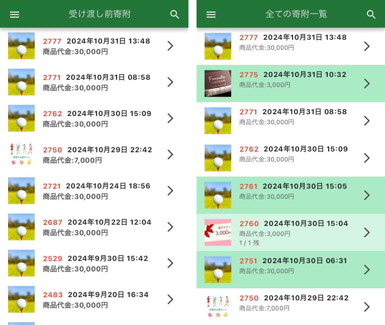
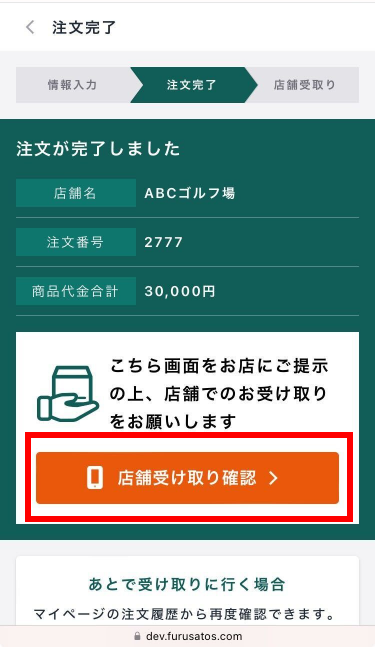
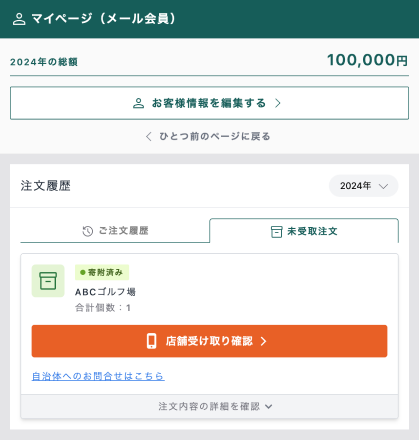
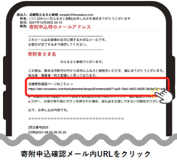
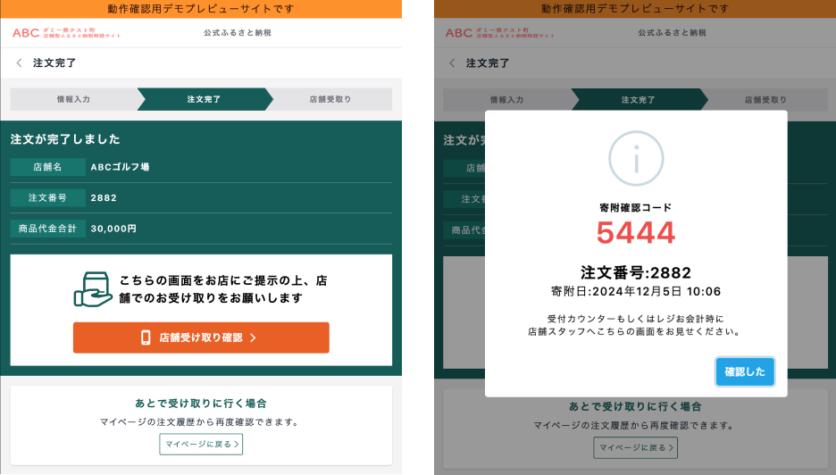
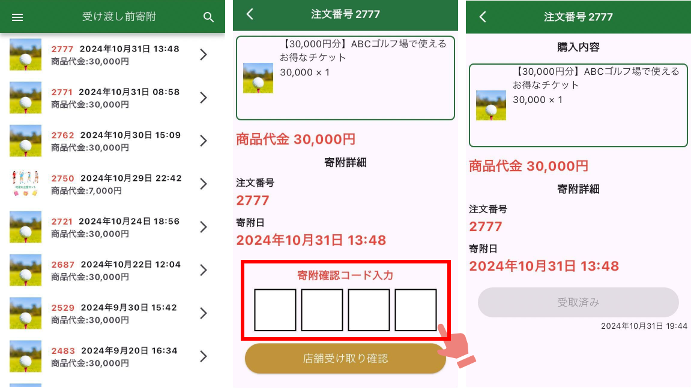

店舗スタッフさまには、返礼品をお渡しする際に専用アプリまたは管理画面で操作をお願いしております。
このページでは店舗スタッフさま向けのアプリでの操作方法をご案内いたします。 

***

## 事前準備

### アプリをダウンロード  

店舗スタッフの寄附確認用に専用アプリを配布しています。

:::note[店舗スタッフ専用アプリ]
Android用アプリ：[ダウンロードリンク](https://play.google.com/store/apps/details?id=com.suncackikaku.furusatos.store)  
iPhone用アプリ  ：[ダウンロードリンク](https://apps.apple.com/jp/app/%E3%81%B5%E3%82%8B%E3%81%95%E3%81%A8%E3%82%BA/id1632550284)
:::

以降はiphone端末での表示画面で説明しております。

### ログインする  

*店舗用ログイン画面（左）とログイン後画面（右）*

アプリを起動させると、ログイン画面が表示されます。  
店舗スタッフアカウントのメールアドレス・パスワードを入力して、ログインできるかご確認ください。  
※初回のメールアドレス・パスワードは運営事務局より発行してご案内しております。

ログインすると「受け渡し前寄附」の画面が表示されます。

***

## 操作方法

### メニュー

*受け渡し前寄附画面（左）とメニュー表示画面（右）*

アプリのメニューは、画面左上のメニューボタン（3本線のアイコン）をタップすることで表示できます。

### 受け渡し前寄附・全ての寄附一覧

*受け渡し前寄附画面（左）と全ての寄附一覧画面（右）*

受け渡し前寄附機能と全ての寄附一覧機能では、どちらも寄附一覧を表示しています。

:::caution[各ページに表示される寄附の違い]
**受け渡し前寄附**：商品の受け渡し（店舗確認）が終わっていない寄附  
**全ての寄附一覧**：全ての寄附一覧。店舗確認が済んでいるものは緑色に表示されます
:::

寄附一覧画面では、右上の検索アイコンから寄附の検索が可能です。（下図）  

*検索機能*

***

## 寄附者へ受取確認画面をご案内  

*受け取り確認画面*

:::note[point]
寄附者が店舗に来店した際、店舗スタッフさまへ受取確認画面の提示が必要です。  
店舗スタッフさまで受取確認画面を確認後、操作が必要となります。  
:::

寄附者が受取確認画面を表示する手順をご案内します。  
寄附者より質問がありましたら下記いずれかの手順をご案内ください。  

### マイページでの確認  
[マイページ](https://furusatos.com/mypage/)の注文履歴「ご注文履歴」から受け取りたい返礼品寄附を選択する。  

*マイページ（注文履歴）*

### 寄附完了メールからの確認  
申込時に届いている寄附確認メール内に店舗受取確認ページのURLがありますので、そこから遷移するようにご案内ください。  

*寄附申込確認メール（イメージ）*

***

## 商品の受け渡し手順（4桁コードver）    

*寄附者の受け取り画面（左）と店舗受け取り確認ボタンを押した後の画面（右）*

### 1. 寄附者で「店舗受け取り確認」を押す  
寄附者が商品を受け取る際、寄附者の画面で「店舗受け取り確認」を押してもらいます。  
「店舗受け取り確認」を押すと、「寄附確認コード」「注文番号」「寄附日」が表示されます。 

*受け渡し前寄附画面（左）・受け取り確認画面（中央）・受け取り完了後画面（右）*

### 2. 受け渡し前寄附画面から一致する寄附を選択する    

寄附者の画面に表示されている「注文番号」「寄附日」と一致する寄附を「受け渡し前寄附」画面から選択します。注文詳細画面で寄附者の画面に表示されている寄附確認コードを「寄附確認コード入力」に4桁の数字を入力し、「店舗受け取り確認」ボタンを押します。  

4桁の数字に誤りがなければ、注文詳細画面に「受取済み」と表示がされますので、寄附者に商品をお渡しください。  

 

***

## その他機能  

### 返礼品非表示機能  

*メニュー表示画面（左）・返礼品表示の画面（中央）・返礼品掲載中止の画面（右）*

店舗オーナー用のアカウントでは返礼品の表示・非表示が管理できます。  
返礼品管理より返礼品一覧を開きます。

- 返礼品の掲載を非表示にしたい場合は、ボタンの青丸の箇所を左にスライドします。
- 掲載を非表示から表示に変更する場合は、白丸の箇所を右にスライドします。

