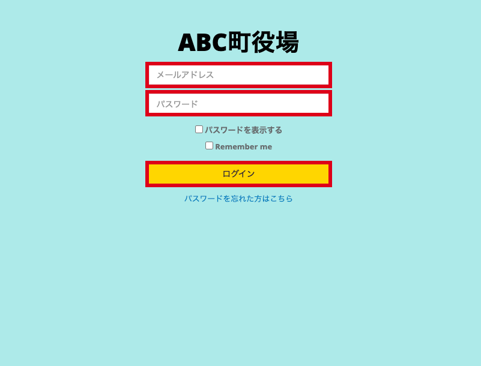
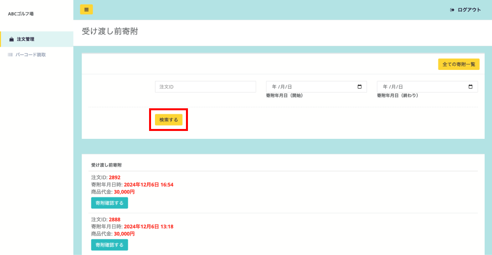
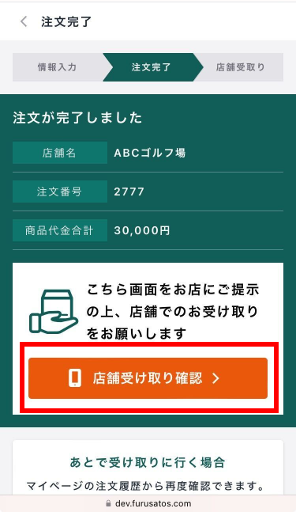
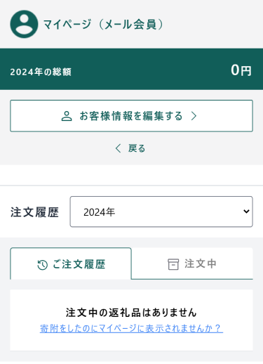
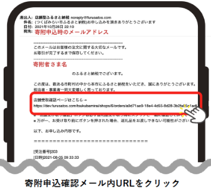
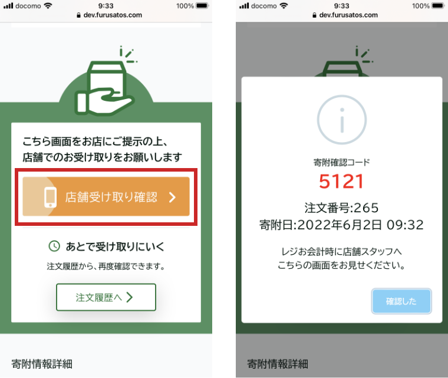
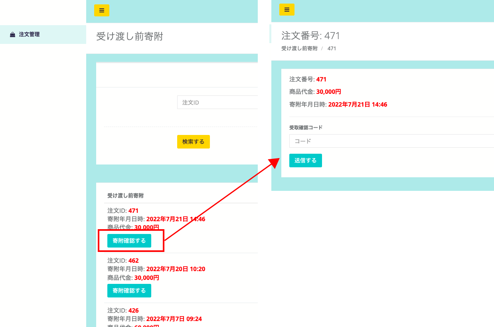
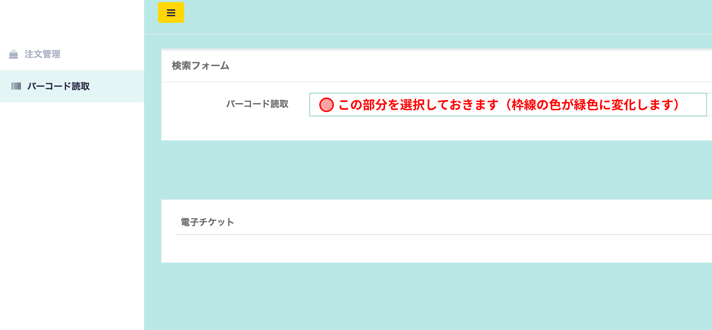
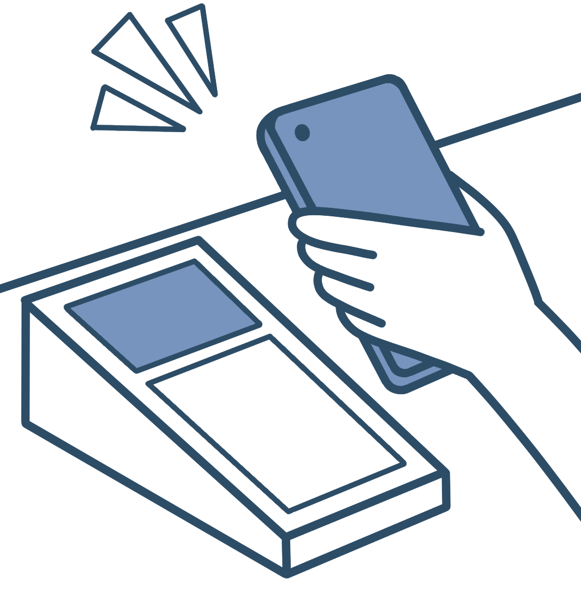
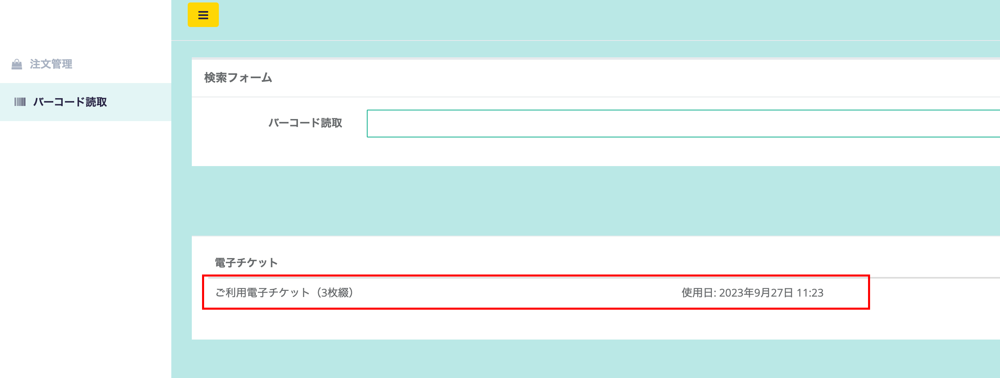

店舗スタッフさまには、返礼品をお渡しする際に専用アプリまたは管理画面で操作をお願いしております。  
このページではPC管理画面での操作方法をご案内いたします。  

***

## 事前準備

### ログインする  

*店舗ログイン画面*

1. 管理画面のログイン画面を開きます。  
2. 店舗スタッフアカウントのメールアドレス・パスワードを入力して、ログインできるかご確認ください。  
※初回のメールアドレス・パスワードは運営事務局より発行してご案内しております。  

*ログイン後画面（受け渡し前寄附一覧）*

ログイン後、スタッフ用画面では「受け渡し前寄附」が表示されます。  
画面上部は、寄附情報の絞り込みが可能です。  
注文IDや寄附年月日を入力し、**「検索する」** ボタンを押下すると寄附情報を絞り込めます。  

***

## 寄附者へ受取確認画面をご案内  

*受け取り確認画面*

:::note[point]
寄附者が店舗に来店した際、店舗スタッフさまへ受取確認画面の提示が必要です。  
店舗スタッフさまで受取確認画面を確認後、操作が必要となります。  
:::

寄附者が受取確認画面を表示する手順をご案内します。  
寄附者より質問がありましたら下記いずれかの手順をご案内ください。  

### マイページでの確認  
[マイページ](https://furusatos.com/mypage/)の注文履歴「ご注文履歴」から受け取りたい返礼品寄附を選択する。  

*マイページ（注文履歴）*

### 寄附完了メールからの確認  
申込時に届いている寄附確認メール内に店舗受取確認ページのURLがありますので、そこから遷移するようにご案内ください。  

*寄附申込確認メール（イメージ）*  

***

## 商品の受け渡し手順（4桁コードver）  

*寄附者の受け取り画面（左）と店舗受け取り確認タップ後の画面（右）*

### 1. 寄附者で「店舗受け取り確認」を押す  
寄附者が商品を受け取る際、寄附者の画面で「店舗受け取り確認」を押してもらいます。  
「店舗受け取り確認」を押すと、「寄附確認コード」「注文番号」「寄附日」が表示されます。 

### 2. 管理画面から一致する寄附を選択する  

*スタッフ向け注文一覧画面（左）と注文詳細画面（右）*

寄附者の画面に表示されている「注文番号」「寄附日」と一致する寄附を管理画面から検索し選択します。注文詳細画面で寄附者の画面に表示されている寄附確認コードを「受取確認コード」に4桁の数字を入力し、「送信する」ボタンを押します。  

4桁の数字に誤りがなければ、注文詳細画面に「受取済み」と表示がされますので、寄附者に商品をお渡しください。  

## 商品の受け渡し手順（電子チケットver）  

電子チケットの確認をパソコンで行う場合は、以下の手順で行います。

1. **設置型のバーコードリーダーとパソコンを接続しておきます。**
    :::note[動作検証済みバーコードリーダー]
    - [NEWLAND NS-FR27](https://www.newlandaidc.com/jp/products/Desktop-Scanner/FR27.html)
    - [ELECOM XF1M11AMD](https://www.elecom.co.jp/products/XF1M11AMD.html)
    - [ビジコム BC-NL3000U2](https://www.busicom.co.jp/h/bc-reader/bc-nl3000u.html)
    :::
    
2. **管理画面でバーコード読取を開き、フォーム内のバーコード読取の箇所を選択しておきます。**
※選択後、枠線が緑色に変化します
    
    
    *読取画面*
    
3. **寄附者のスマートフォン（もしくは紙）に表示された二次元コードをバーコードリーダーで読み取ります。**
    
    
    

読み取り完了後は下記のように、読み取れた電子チケットの情報が表示されます。（赤枠内）  
電子チケットの読取対応は以上です。

:::caution[電子チケットの確認方法]
電子チケットについての対応の流れは、下記に詳しくまとめておりますのでお時間がある際にご確認ください。  
[電子チケットの確認方法について](../../lg/e-ticket/)
:::
